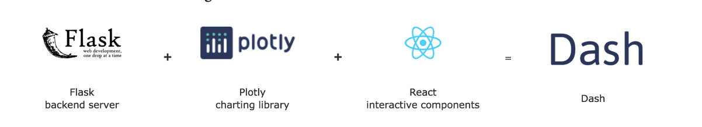

## 0. [Dash說明文件](https://dash.plotly.com/)

## 1. Dash相關生態環境

### 必需要安裝的軟體
- python3.6以上
- pycharm or visual studio code (IDE)

### Dash是什麼?

Dash = Flask(backend server) + plotly(charting library) + React(interactivate components)



### Dash是由多個小型的套件所組成
- Dash不是一個大型的套件
- 由非常多小型的套件所組成
- 每個套件都有特定的功能
- 也有提供第三方套件

### 本章會使用到的套件

#### Dash
- 整個app的骨架
- dash.Dash

#### Dash Core Components
- 提供一些基本的元件
- Dropdowns
- date pickers
- sliders


#### Dash HTML Components
- 提供所有在網頁要顯示的HTML標籤,每個標籤都有對應的class
- dash_html_components.H1('Helllo, World')

#### Dash Bootstrap Components
- 第3方套件
- 可以讓網頁套用Bootstrapd 

#### 安裝Dash

```
pip install dash
```

```
#raspberry
#無法在虛擬環境執行
$sudo apt-get install python3-flask
$sudo apt install python3-plotly python3-pandas
$pip3 install dash 
```

#### 了解Dash app 基本組成架構

- lesson1目錄

```python
import dash
from dash import html

app = dash.Dash(__name__)
app.layout = html.Div([
    html.H1('Hello, World!')
])

if __name__ == '__main__':
    app.run_server(debug=True)

```


#### 增加HTML和其它的component

- leson2目錄

```python
html.Div(children=[component_1, component_2, component_3,...])
```


#### 一般使用的參數

目前HTML Components有130個以上,還有20個參數

- children([]) - 子元素
- className - 元素的class屬性
- id - 元素的id屬性
- style - 元素style屬性

```python
import dash
from dash import html

app = dash.Dash(__name__)
app.layout = html.Div([
    html.H1(children='Poverty And Equitey Database',
            style={
                'color':'blue',
                'fontSize':'40px',
            }),
    html.H2('The World Bank'),
    html.P('Key Facts:'),
    html.Ul([
        html.Li('Number of Economies: 170'),
        html.Li('Temporal Coverage:1974 - 2019'),
        html.Li('Update Frequency:Quarterly'),
        html.Li('Last Updated: March 18, 2020'),
        html.Li([
            'Source:',
            html.A('https://datacatalog.worldbank.org/dataset/poverty-and-equity-database',
                   href='https://datacatalog.worldbank.org/dataset/poverty-and-equity-database'
                   )
        ])
    ])
])

if __name__ == '__main__':
    app.run_server(debug=True)

```

#### 架構版面和管理外觀

```

pip install dash-bootstrap-components

```

- 使用Dash Bootstrap Components
	- Themes: 提供預設的外觀樣版
	- Grid system: 網頁Layout設定
	- Responsiveness: 符合不同螢幕顯示
	- Prebuilt components: 可自訂的Components
	- Encoded colors:提供預設顏色

##### Themes

- lesson3目錄

```python
import dash
from dash import html
import dash_bootstrap_components as dbc

app = dash.Dash(__name__,external_stylesheets=[dbc.themes.BOOTSTRAP])
app.layout = html.Div([
    html.H1(children='Poverty And Equitey Database',
            style={
                'color':'blue',
                'fontSize':'40px',
            }),
    html.H2('The World Bank'),
    html.P('Key Facts:'),
    html.Ul([
        html.Li('Number of Economies: 170'),
        html.Li('Temporal Coverage:1974 - 2019'),
        html.Li('Update Frequency:Quarterly'),
        html.Li('Last Updated: March 18, 2020'),
        html.Li([
            'Source:',
            html.A('https://datacatalog.worldbank.org/dataset/poverty-and-equity-database',
                   href='https://datacatalog.worldbank.org/dataset/poverty-and-equity-database'
                   )
        ])
    ])
])

if __name__ == '__main__':
    app.run_server(debug=True)

```

	