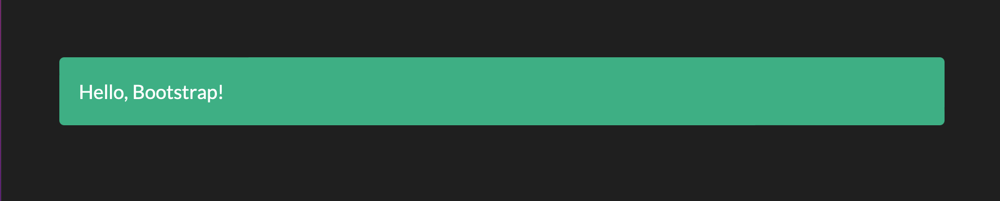

# Dash Bootstrap

## 安裝

```
pip install dash-bootstrap-components
```


## Bootstrap 有各種主題可以直接套用(theme)

- 可測試套用不的theme
- [不同種類的theme](https://bootswatch.com/default/)

```python
import dash
import dash_bootstrap_components as dbc

app = dash.Dash(
    external_stylesheets=[dbc.themes.BOOTSTRAP] #套用theme
)

app.layout = dbc.Alert(
    "Hello, Bootstrap!", className="m-5"
)

if __name__ == "__main__":
    app.run_server()
```


```python
import dash
import dash_bootstrap_components as dbc

app = dash.Dash(
    external_stylesheets=[dbc.themes.DARKLY]
)

app.layout = dbc.Alert(
    "Hello, Bootstrap!", className="m-5"
)

if __name__ == "__main__":
    app.run_server()
```




