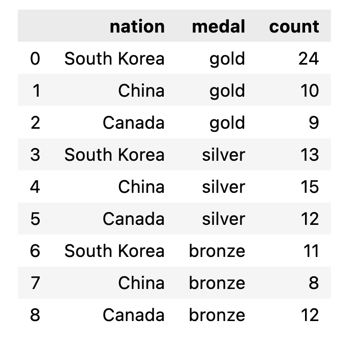
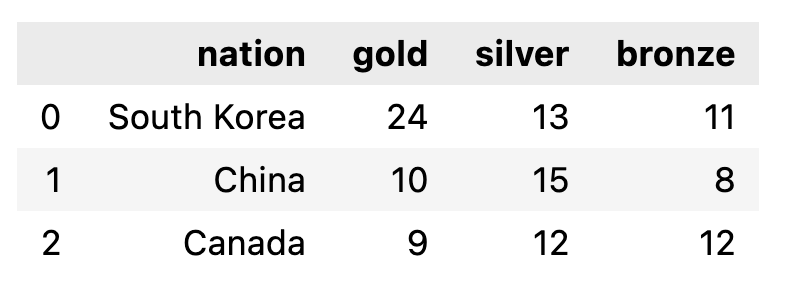

## Plotly Express 支援的資料類型

### Plotly Express支援欄位導向,矩陣,地理資料
#### 欄位導向
- 一般的圖表px.bar(),px.scatter() 
- 支援 Pandas DataFrame 
- longDataFrame
- wideDataFrame
#### 矩陣
- px.imshow()
- 支援2維,3維資料
- Numpy ndArray
- 巢狀的list
- 大部份表現圖片和顏色

#### 地理資訊
- px.choropleth(),px.choropleth_mapbox()
- GeoPandas GeoDataFrame

#### Plotly Expree 支援Long-,Wide-,Mixed-表格資料

- Long表格資訊可表達多維資訊
- Wide表格資訊可表達2維資訊
- Mixed混合2維和多維

#### longdata

```python
import plotly.express as px
long_df = px.data.medals_long()
long_df
```



#### widedata

```python
import plotly.express as px
wide_df = px.data.medals_wide()
wide_df
```




