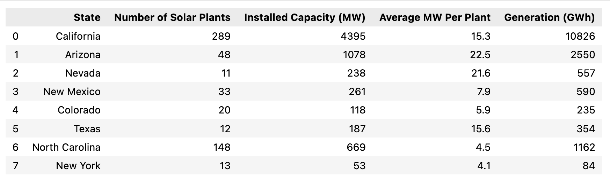
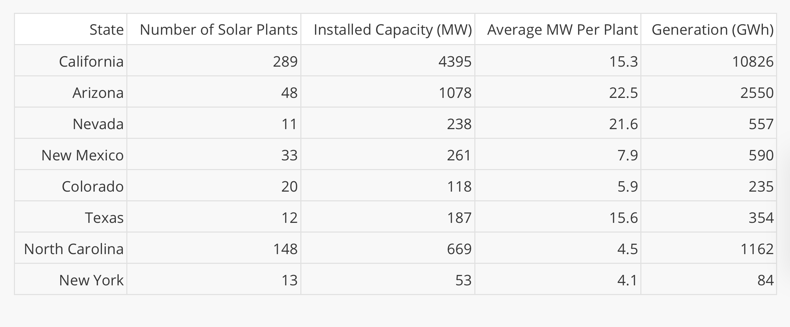
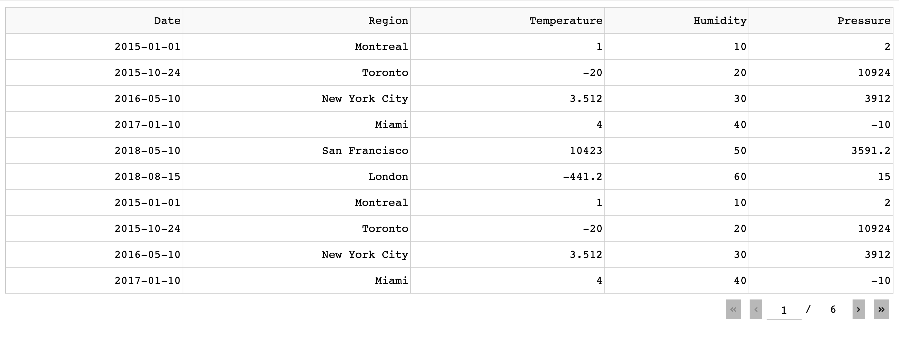
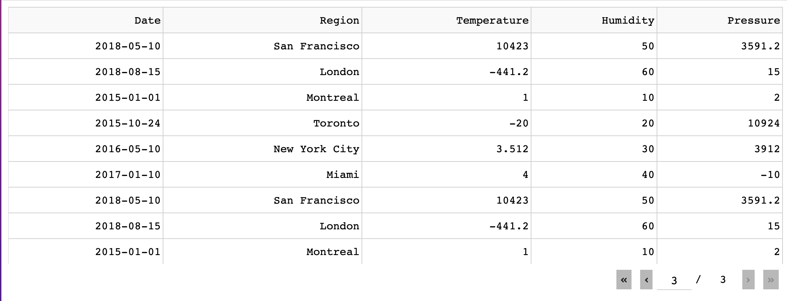
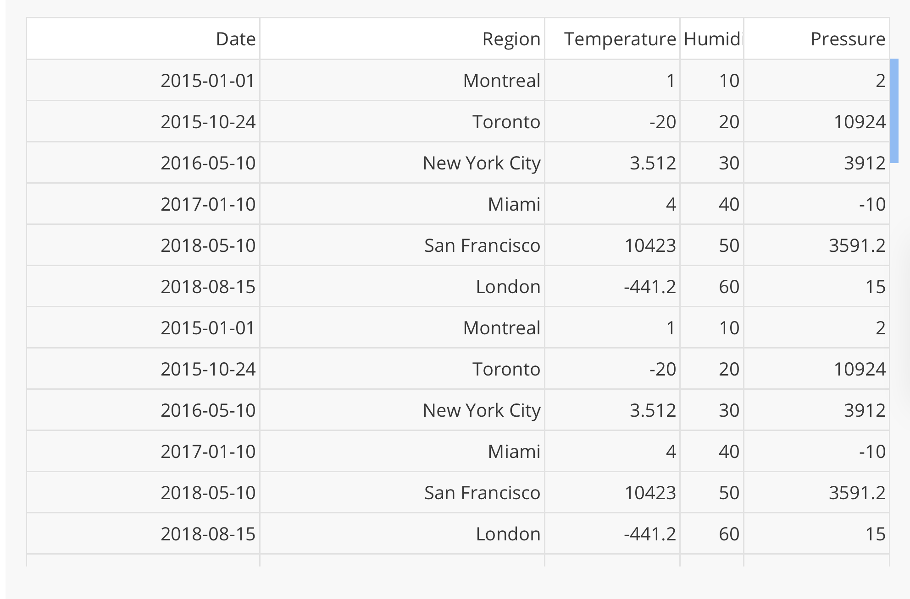

# Dash_Table

- 可互動
- 可編輯
- 可顯示大型Data Set

## dash_table.DataTable(data=xxx,columns=xxx)
- data是list內有dict
- columns是list內有dict

```python

from dash import Dash, dash_table
import pandas as pd

df = pd.read_csv('https://raw.githubusercontent.com/plotly/datasets/master/solar.csv')


app = Dash(__name__)


app.layout = dash_table.DataTable(df.to_dict('records'), [{"name": i, "id": i} for i in df.columns])

if __name__ == '__main__':
    app.run_server(debug=True)

```




## click事件

```python
from dash import Dash, Input, Output, callback, dash_table
import pandas as pd
import dash_bootstrap_components as dbc

df = pd.read_csv('https://git.io/Juf1t')
app = Dash(external_stylesheets=[dbc.themes.BOOTSTRAP])

app.layout = dbc.Container([
    dbc.Label('Click a cell in the table:'),
    dash_table.DataTable(df.to_dict('records'),[{"name":i, "id":i} for i in df.columns],id='tb1'),
    dbc.Alert(id='tbl_out')
])

@callback(
    Output('tbl_out','children'),
    Input('tb1','active_cell')
)
def update_graphs(active_cell):
    return str(active_cell) if active_cell else "Click the Table"

if __name__ == "__main__":
    app.run_server(debug=True)
```

## DataTable可以顯示的Rows
- default 250個row
- 超過250個row,會產生換頁按鈕

### 自訂可以顯示的Rows

```python
from dash import Dash, dash_table
import pandas as pd
from collections import OrderedDict

app = Dash(__name__)

data = OrderedDict(
     [
        ("Date", ["2015-01-01", "2015-10-24", "2016-05-10", "2017-01-10", "2018-05-10", "2018-08-15"]),
        ("Region", ["Montreal", "Toronto", "New York City", "Miami", "San Francisco", "London"]),
        ("Temperature", [1, -20, 3.512, 4, 10423, -441.2]),
        ("Humidity", [10, 20, 30, 40, 50, 60]),
        ("Pressure", [2, 10924, 3912, -10, 3591.2, 15]),
    ]
)

df = pd.DataFrame(
    OrderedDict([(name, col_data *10) for (name, col_data) in data.items()])
)

app.layout = dash_table.DataTable(
    data = df.to_dict("records"),
    columns = [{'id':c, 'name':c} for c in df.columns],
    page_size=10
)

if __name__ == '__main__':
    app.run_server(debug=True)
```



## 表格和垂直捲動軸

```python
from dash import Dash, dash_table
import pandas as pd
from collections import OrderedDict

app = Dash(__name__)

data = OrderedDict(
    [
        ("Date", ["2015-01-01", "2015-10-24", "2016-05-10", "2017-01-10", "2018-05-10", "2018-08-15"]),
        ("Region", ["Montreal", "Toronto", "New York City", "Miami", "San Francisco", "London"]),
        ("Temperature", [1, -20, 3.512, 4, 10423, -441.2]),
        ("Humidity", [10, 20, 30, 40, 50, 60]),
        ("Pressure", [2, 10924, 3912, -10, 3591.2, 15]),
    ]
)

df = pd.DataFrame(
    OrderedDict([(name, col_data * 10) for (name, col_data) in data.items()])
)

app.layout = dash_table.DataTable(
    data = df.to_dict('records'),
    columns = [{'id':c, 'name':c} for c in df.columns],
    page_size=20,
    style_table={'height':'300px', 'overflowY':'auto'}
)

if __name__ == "__main__":
    app.run_server(debug=True)
```



## 垂直捲動軸和固定不動的欄位標題

```python
from dash import Dash, dash_table
import pandas as pd
from collections import OrderedDict

app = Dash(__name__)

data = OrderedDict(
    [
        ("Date", ["2015-01-01", "2015-10-24", "2016-05-10", "2017-01-10", "2018-05-10", "2018-08-15"]),
        ("Region", ["Montreal", "Toronto", "New York City", "Miami", "San Francisco", "London"]),
        ("Temperature", [1, -20, 3.512, 4, 10423, -441.2]),
        ("Humidity", [10, 20, 30, 40, 50, 60]),
        ("Pressure", [2, 10924, 3912, -10, 3591.2, 15]),
    ]
)

df = pd.DataFrame(
    OrderedDict([(name, col_data * 10) for (name, col_data) in data.items()])
)

app.layout = dash_table.DataTable(
    data = df.to_dict('records'),
    columns = [{'id':c, 'name':c} for c in df.columns],
    fixed_rows={'headers':True},
    style_table={'height':400} #default to 500
)

if __name__ == "__main__":
    app.run_server(debug=True)
```




