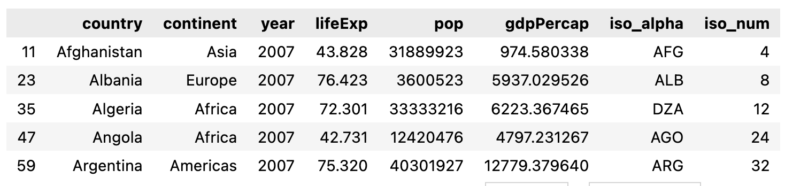
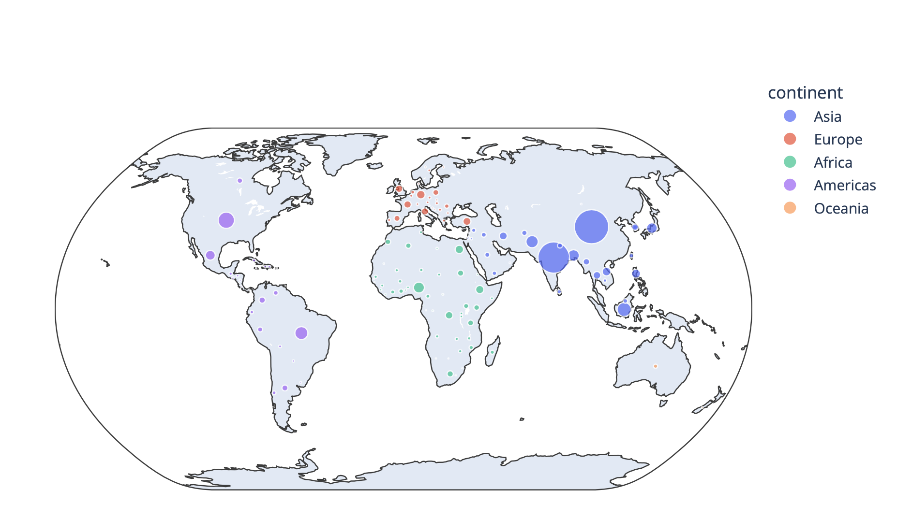
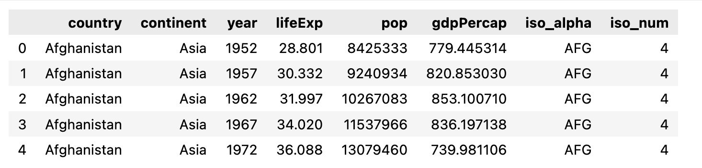
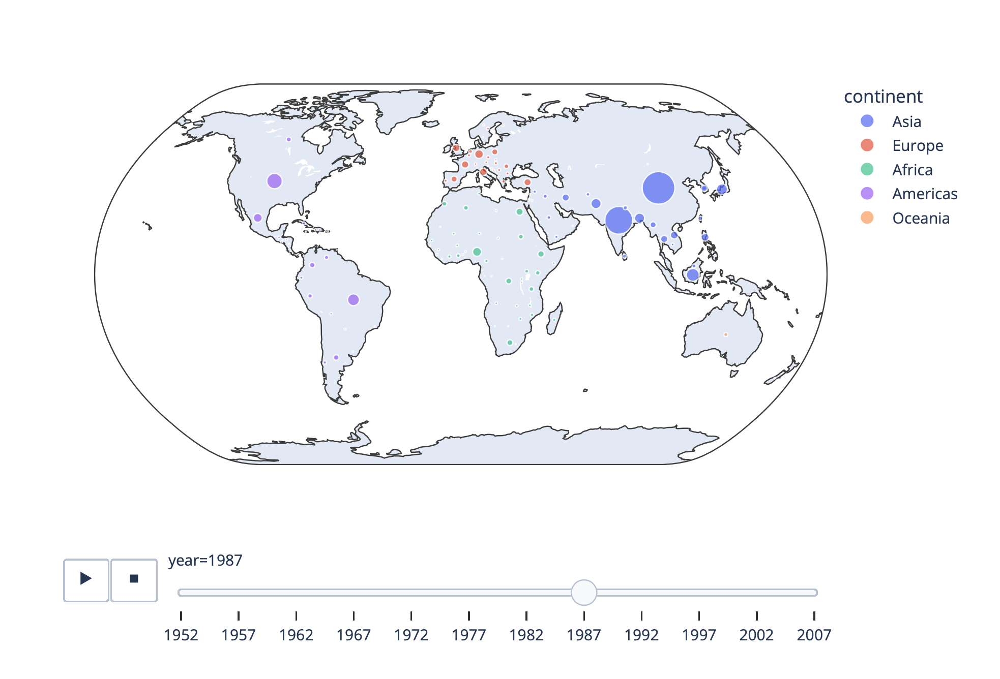

# 泡泡地圖(Bubble Map)
- 使用大小分級
- px.scatter_geo
- px.line_geo
- px.choropleth
- go.Choropleth
- go.Scattergeo

## 使用Plotly Express 的 Bubble Map

```python
import plotly.express as px
df = px.data.gapminder().query("year==2007")

fig = px.scatter_geo(df,
                     locations="iso_alpha",
                     color="continent",
                     hover_name="country",
                     size="pop",
                     projection="natural earth"
)
fig.show()
```





## 動態的Bubble Map

```python
import plotly.express as px
df = px.data.gapminder()
fig = px.scatter_geo(df,
                     locations="iso_alpha",
                     color="continent",
                     hover_name="country",
                     size="pop",
                     animation_frame="year",
                     projection="natural earth"
)
fig.show()
```





