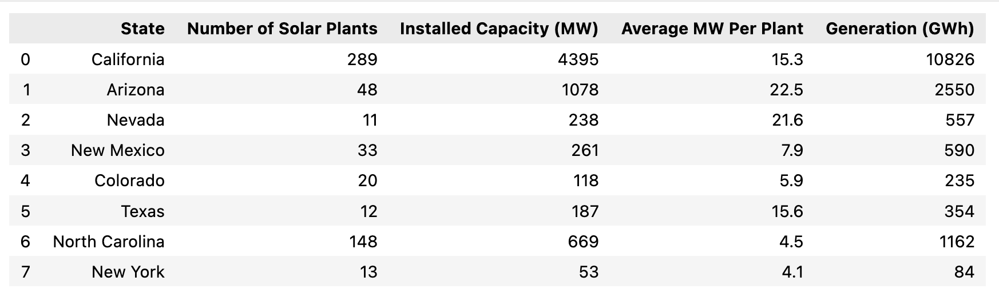
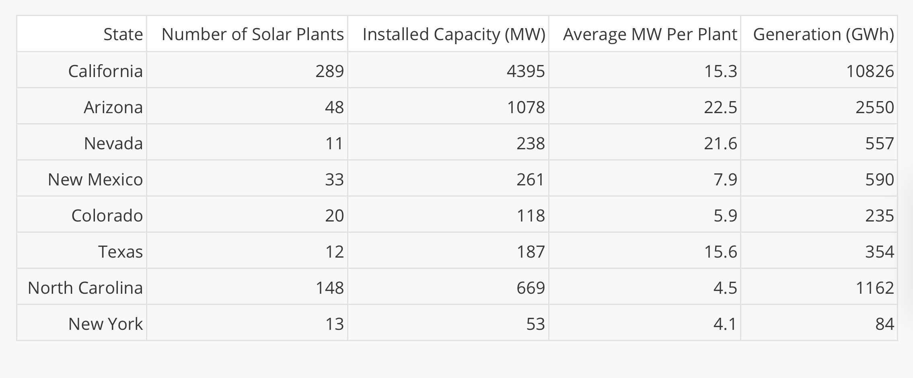
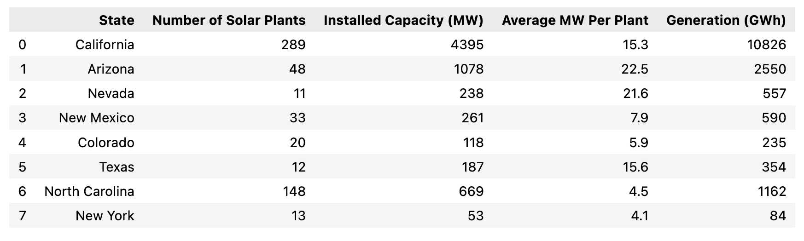
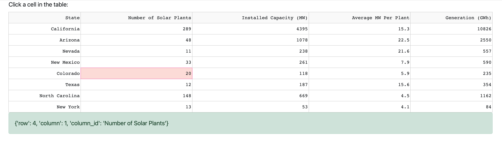
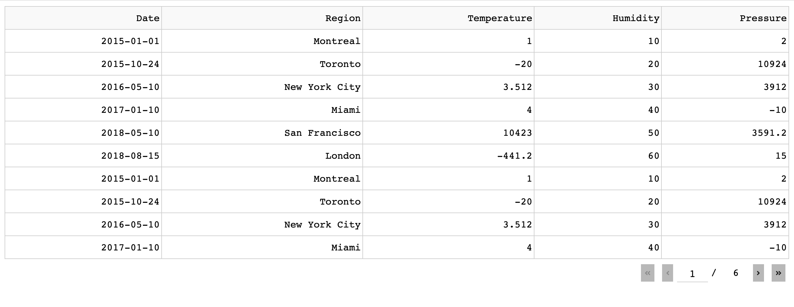
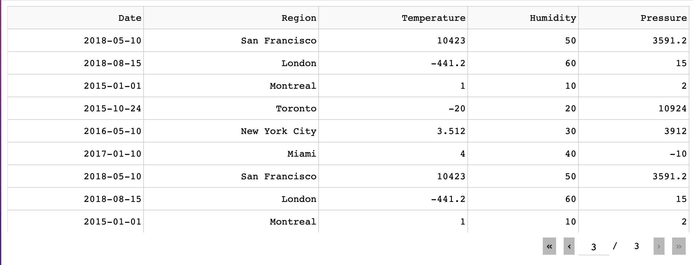
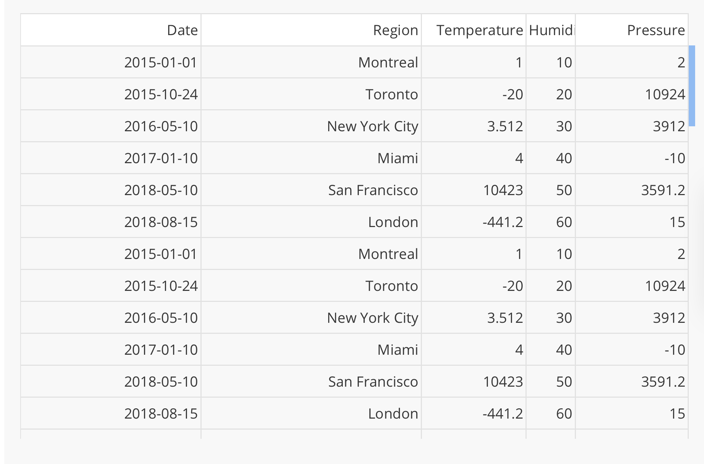

## Scater和RangeSlider
- 以點表示的圖表

```python
import plotly.express as px
fig = px.scatter(x=[0,1,2,3,4], y=[0,1,4,9,16])
fig.show()
```



```python
#x and y使用DataFrame Columns
import plotly.express as px
df = px.data.iris()
fig = px.scatter(df, x = 'sepal_width', y='sepal_length')
fig.show()
```





## 設定點大小和顏色

```python
import plotly.express as px
df = px.data.iris()
fig = px.scatter(df,
                x="sepal_width",
                y="sepal_length",
                color="species",
                size="petal_length",
                hover_data=['petal_width']
)
fig.show()
```



```python
import plotly.express as px
df = px.data.iris()
fig = px.scatter(df,
                 x="sepal_width",
                 y="sepal_length",
                 color="petal_length"
)
fig.show()
```



###  symbol argument

```python
import plotly.express as px
pd = px.data.iris()
fig = px.scatter(df,
                 x="sepal_width",
                 y="sepal_length",
                 color="species",
                 symbol="species"
)

fig.show()
```



### 支援trendlind
- pip install statsmodels

```python
import plotly.express as px

df = px.data.tips()
fig = px.scatter(df,
                 x="total_bill",
                 y="tip",
                 trendline="ols"
)
fig.show()
```




### 整合dash

```python
from dash import Dash, dcc, html, Input, Output
import plotly.express as px

app = Dash(__name__)

app.layout = html.Div([
    html.H4("Interactive scatter plot with Iris dataset"),
    dcc.Graph(id="scatter-plot"),
    html.P("Filter by petal width:"),
    dcc.RangeSlider(
        id="ranger-slider",
        min=0, max=2.5, step=0.1,
        marks={0:'0',2.5:'2.5'},
        value=[0.5, 2]
    )
])

@app.callback(
    Output("scatter-plot","figure"),
    Input("ranger-slider","value")
)
def update_bar_chart(slider_range):
    df = px.data.iris()
    low, high = slider_range
    mask = (df['petal_width'] > low) & (df['petal_width'] < high)
    fig = px.scatter(
        df[mask],
        x="sepal_width",
        y="sepal_length",
        color="species",
        size="petal_length",
        hover_data = ["petal_width"]

    )
    return fig

app.run_server(debug=True)
```


