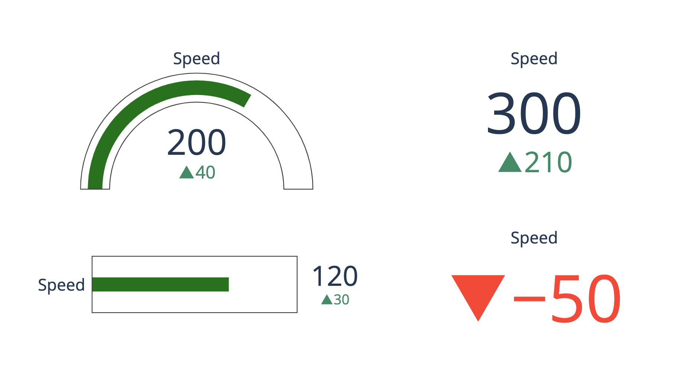
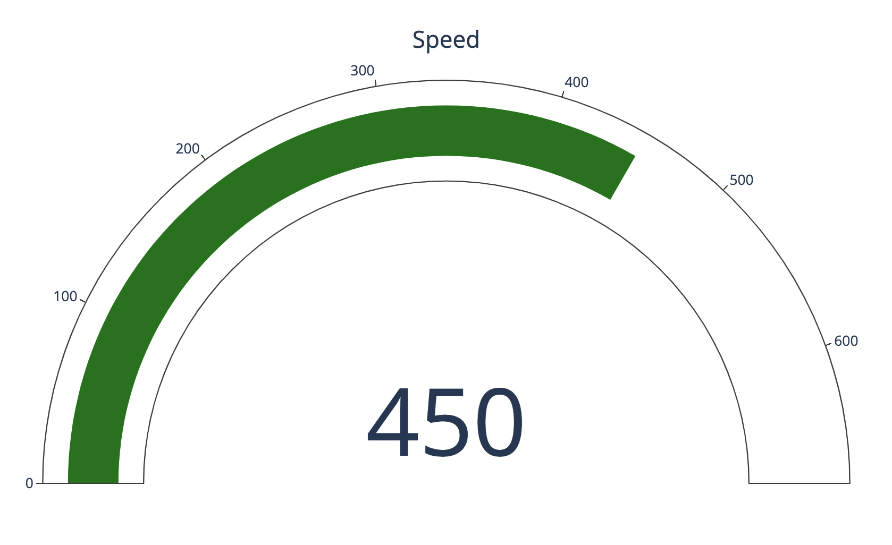
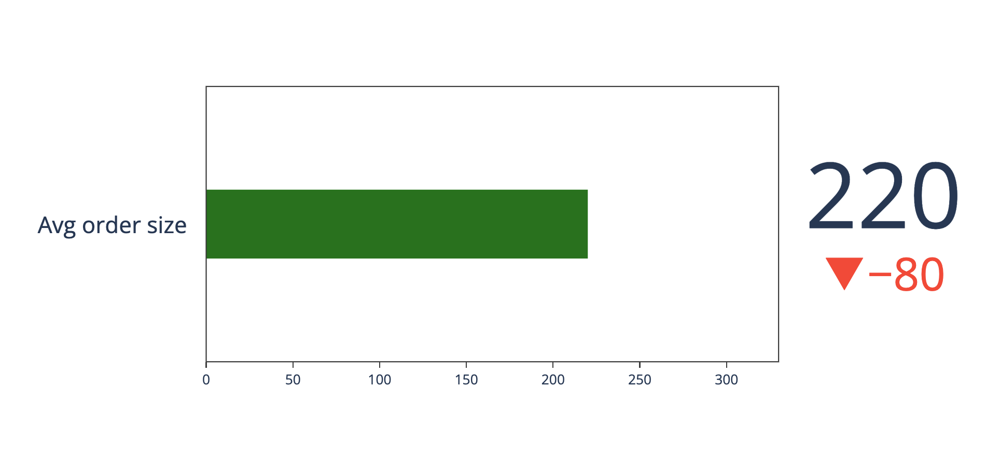
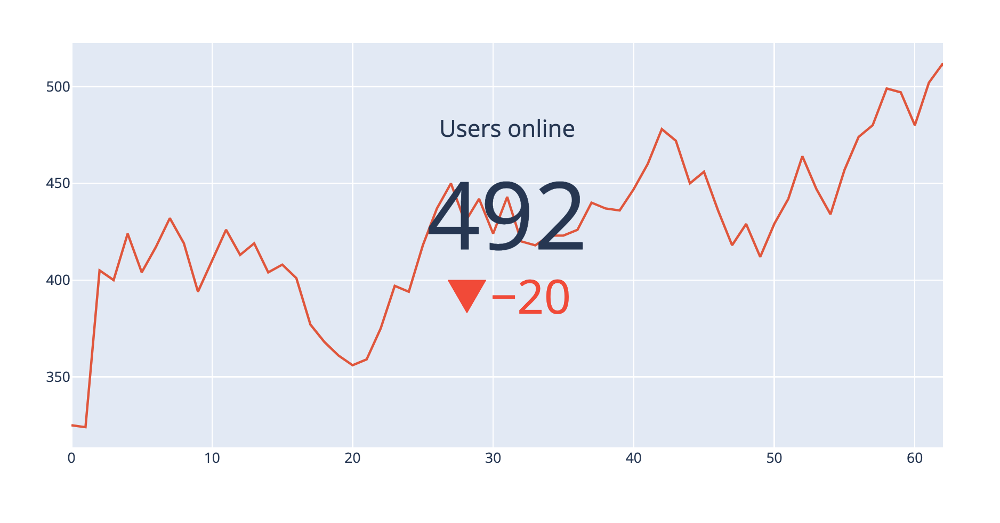

## indicators的charts

- gauge(量測工具)

```python
import plotly.graph_objects as go

fig = go.Figure()

fig.add_trace(go.Indicator(
    value = 200,
    delta = {'reference': 160},
    gauge = {
        'axis': {'visible': False}},
    domain = {'row': 0, 'column': 0}))

fig.add_trace(go.Indicator(
    value = 120,
    gauge = {
        'shape': "bullet",
        'axis' : {'visible': False}},
    domain = {'x': [0.05, 0.5], 'y': [0.15, 0.35]}))

fig.add_trace(go.Indicator(
    mode = "number+delta",
    value = 300,
    domain = {'row': 0, 'column': 1}))

fig.add_trace(go.Indicator(
    mode = "delta",
    value = 40,
    domain = {'row': 1, 'column': 1}))

fig.update_layout(
    grid = {'rows': 2, 'columns': 2, 'pattern': "independent"},
    template = {'data' : {'indicator': [{
        'title': {'text': "Speed"},
        'mode' : "number+delta+gauge",
        'delta' : {'reference': 90}}]
                         }})

fig.show()
```




### 單一角度的gauge

```python
import plotly.graph_objects as go

fig = go.Figure(go.Indicator(
    mode = "gauge+number",
    value = 450,
    title = {'text': "Speed"},
    domain = {'x': [0, 1], 'y': [0, 1]}
))

fig.show()
```



### Bullet Gauge

```python
import plotly.graph_objects as go
fig = go.Figure(
    go.Indicator(
        mode = "number+gauge+delta",
        gauge = {"shape":"bullet"},
        delta = {'reference':300},
        value = 220,
        domain = {'x':[0.2,1],'y':[0.2,0.9]},
        title = {'text':'Avg order size'}
    )
)
fig.show()
```



### 顯示在別的chart上

```python
import plotly.graph_objects as go

fig = go.Figure(go.Indicator(
    mode = "number+delta",
    value = 492,
    delta = {"reference": 512, "valueformat": ".0f"},
    title = {"text": "Users online"},
    domain = {'y': [0, 1], 'x': [0.25, 0.75]}))

fig.add_trace(go.Scatter(
    y = [325, 324, 405, 400, 424, 404, 417, 432, 419, 394, 410, 426, 413, 419, 404, 408, 401, 377, 368, 361, 356, 359, 375, 397, 394, 418, 437, 450, 430, 442, 424, 443, 420, 418, 423, 423, 426, 440, 437, 436, 447, 460, 478, 472, 450, 456, 436, 418, 429, 412, 429, 442, 464, 447, 434, 457, 474, 480, 499, 497, 480, 502, 512, 492]))

fig.update_layout(xaxis = {'range': [0, 62]})
fig.show()
```

