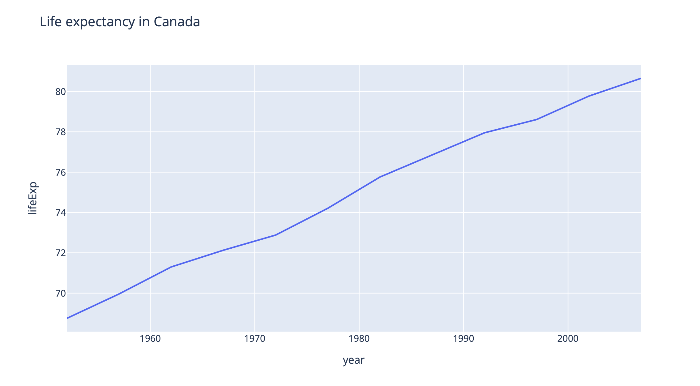
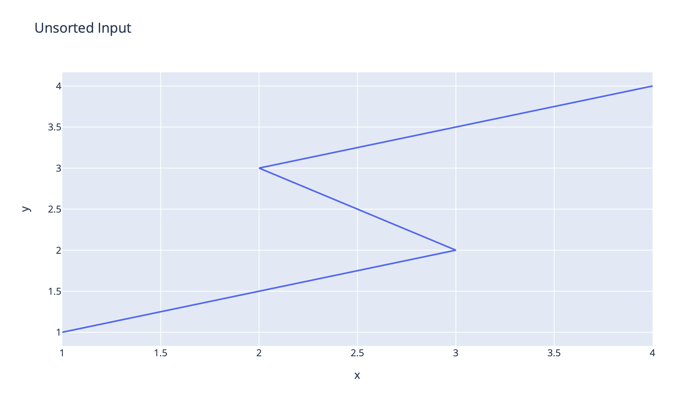
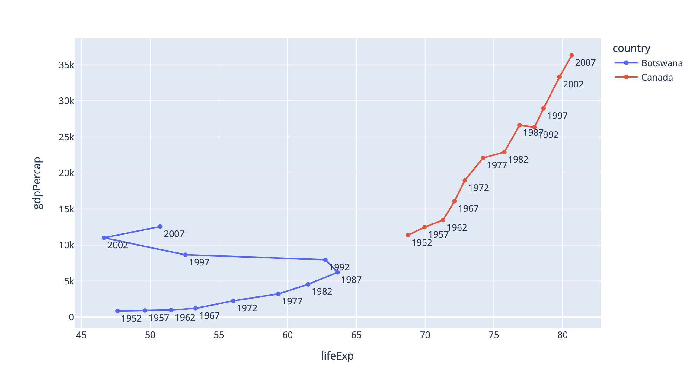
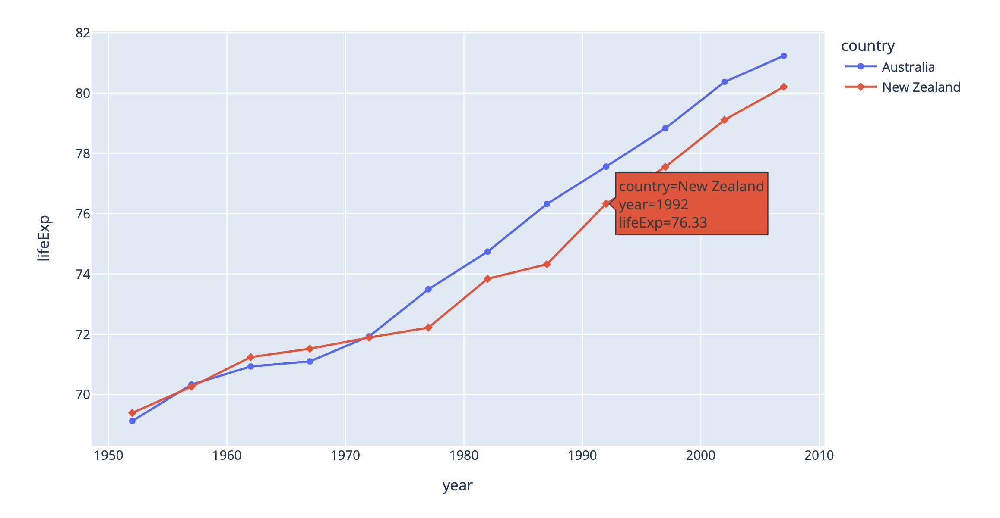
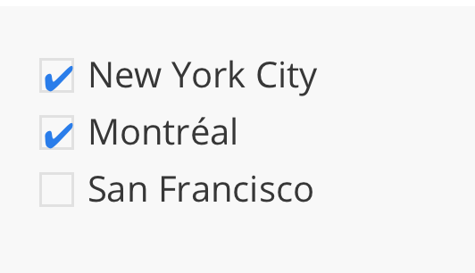
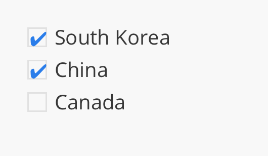
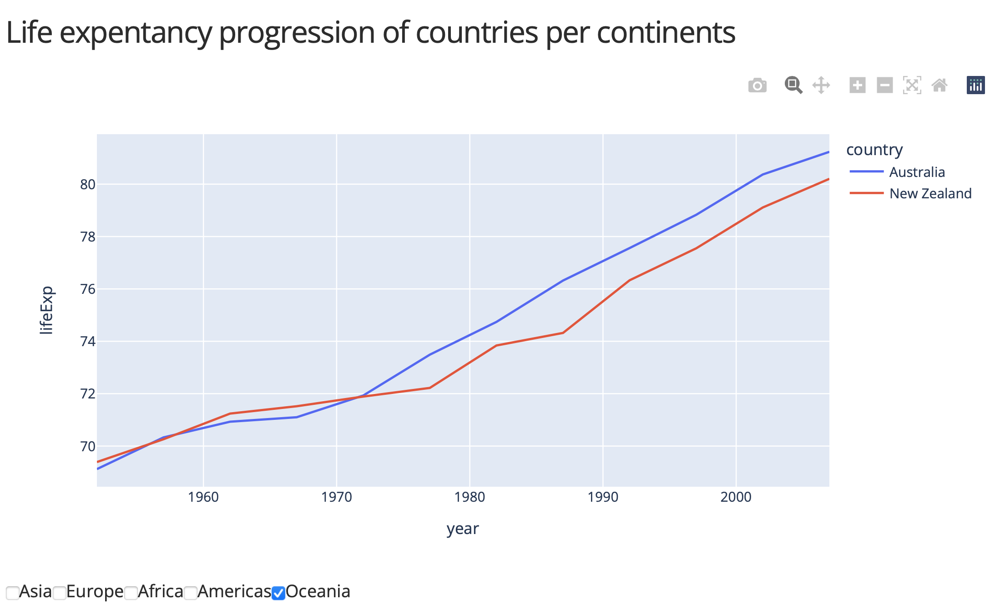

## LineChart和CheckList

### LineChart

#### 最基本語法

```python
import plotly.express as px

df = px.data.gapminder().query("country=='Canada'")
fig = px.line(df, x="year", y="lifeExp", title='Life expectancy in Canada')
fig.show()
```



#### 使用color分類

```python
import plotly.express as px
df = px.data.gapminder().query("continent=='Oceania'")
print(df)
fig = px.line(
    df,
    x="year",
    y='lifeExp',
    color='country'
)
fig.show()
```


#### lineChart 的資料順序
- line Chart 會自動連結點和點

```python
import plotly.express as px
import pandas as pd

df = pd.DataFrame(dict(
    x = [1, 3, 2, 4],
    y = [1, 2, 3, 4]
))

fig = px.line(
    df,
    x="x",
    y="y",
    title="unsorted Input"
)
fig.show()

df.sort_values(by="x")
fig = px.line(
    df,
    x="x",
    y="y",
    title="Sorted Input"
)
fig.show()
```




#### 連結散佈圖表

- 一般是時間當變數

```python
import plotly.express as px

df = px.data.gapminder().query("country in ['Canada', 'Botswana']")
fig = px.line(
    df,
    x='lifeExp',
    y='gdpPercap',
    color='country',
    text='year'
)
fig.update_traces(textposition='bottom right')
fig.show()
```



#### line charts使用屬性markers

```python
import plotly.express as px
df = px.data.gapminder().query("continent == 'Oceania'")
fig = px.line(df, x='year', y='lifeExp', color='country', symbol="country")
fig.show()
```

[Styling Markers in Python](https://plotly.com/python/marker-style/)



#### line charts將時間當x軸

```python
import plotly.express as px

df = px.data.stocks()
fig = px.line(
    df,
    x='date',
    y='GOOG'
)

fig.show()
```


#### Line Plot的Mode屬性

```python
import plotly.graph_objects as go
import numpy as np
np.random.seed(1)

N = 100
random_x = np.linspace(0, 1, N)
random_y0 = np.random.randn(N) + 5
random_y1 = np.random.randn(N)
random_y2 = np.random.randn(N) - 5

fig = go.Figure()
fig.add_trace(go.Scatter(
    x=random_x,
    y=random_y0,
    mode='lines',
    name='lines'
))

fig.add_trace(go.Scatter(
    x=random_x,
    y=random_y1,
    mode='lines+markers',
    name='lines+markers'
))

fig.add_trace(go.Scatter(
    x=random_x,
    y=random_y2,
    mode='markers',
    name='markers'
))

fig.show()

```


### Checklist
- 類似RadioItems
- 類似Dropdown
- 可以複選

```python
from dash import Dash,html,dcc

app = Dash(__name__)
app.layout = html.Div(
    dcc.Checklist(
        ['New York City', 'Montréal', 'San Francisco'],
        ['New York City', 'Montréal']
    )
)

if __name__ == "__main__":
    app.run_server(debug=True)
```



#### 水平屬性inline

```python
from dash import Dash,html,dcc

app = Dash(__name__)
app.layout = html.Div(
    dcc.Checklist(
        ['New York City', 'Montréal', 'San Francisco'],
        ['New York City', 'Montréal'],
        inline=True
    )
)

if __name__ == "__main__":
    app.run_server(debug=True)
```


#### options and Value

```
dcc.Checklist(['New York City', 'Montreal', 'San Francisco'], ['Montreal'])
```

```python
dcc.Checklist(
   options=['New York City', 'Montreal', 'San Francisco'],
   value=['Montreal']
)
```

```python
dcc.Checklist(
   options=[
       {'label': 'New York City', 'value': 'New York City'},
       {'label': 'Montreal', 'value': 'Montreal'},
       {'label': 'San Francisco', 'value': 'San Francisco'},
   ],
   value=['Montreal']
)
```

```python
dcc.Checklist(
   options={
        'New York City': 'New York City',
        'Montreal': 'Montreal',
        'San Francisco': 'San Francisco'
   },
   value=['Montreal']
)
```

#### 變動的資料來源

```python
from turtle import pd
from dash import Dash,html,dcc
import pandas as pd
from plotly.express import data

app = Dash(__name__)
df = data.medals_long()
print(df.columns)
app.layout = html.Div(
    dcc.Checklist(
       df.columns,
       df.columns[0:2].values
    )
)

if __name__ == "__main__":
    app.run_server(debug=True)
```


```python
from turtle import pd
from dash import Dash,html,dcc
import pandas as pd
from plotly.express import data

app = Dash(__name__)
df = data.medals_long()
print(df.columns)
app.layout = html.Div(
    dcc.Checklist(
       df.nation.unique(),
       df.nation.unique()[0:2]
    )
)

if __name__ == "__main__":
    app.run_server(debug=True)
```



#### lineChart整合checklist

```
from dash import Dash, dcc, html, Input, Output
import plotly.express as px

app = Dash(__name__)
app.layout = html.Div([
    html.H4('Life expentancy progression of countries per continents'),
    dcc.Graph(id='graph'),
    dcc.Checklist(
        id='checklist',
        options=["Asia", "Europe", "Africa","Americas","Oceania"],
        value = ["Americas", "Oceania"],
        inline=True
    )
])

@app.callback(
    Output("graph","figure"),
    Input("checklist","value")
)

def update_line_chart(continents):
    df = px.data.gapminder()
    mask = df.continent.isin(continents)
    fig = px.line(
        df[mask],
        x='year',
        y='lifeExp',
        color='country'
    )
    return fig

if __name__ == "__main__":
    app.run_server(debug=True)

```




