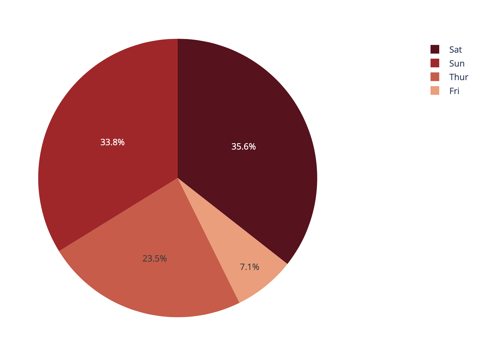
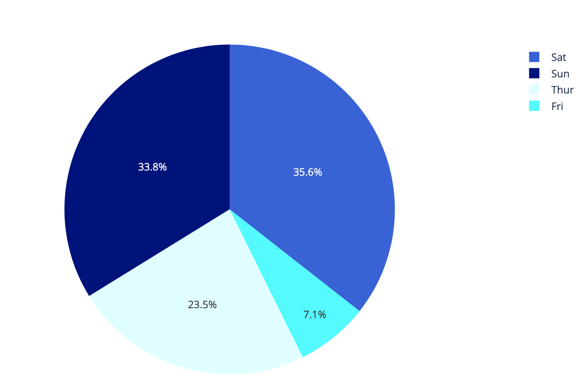

## Pie Chart 和 Drowdown 整合

```python
import plotly.express as px
df = px.data.gapminder().query("year == 2007").query("continent == 'Europe'")
df.loc[df['pop'] < 2.e6, 'country'] = 'Other countries' # Represent only large countries
fig = px.pie(df, values='pop', names='country', title='Population of European continent')
fig.show()
```


### pie chart 和重覆的資訊

```python
df = px.data.tips()
import plotly.express as px
# This dataframe has 244 lines, but 4 distinct values for `day`
df = px.data.tips()
fig = px.pie(df, values='tip', names='day')
fig.show()
```


### 設定pie chart 區塊連續顏色

```python
#連續色
import plotly.express as px
fig = px.colors.sequential.swatches_continuous()
fig.show()
```


```python
import plotly.express as px
df = px.data.tips()
fig = px.pie(df, values='tip', names='day', color_discrete_sequence=px.colors.sequential.RdBu)
fig.show()
```




### 設定pie chart 區塊明確顏色

```python
import plotly.express as px
df = px.data.tips()
#使用css color
fig = px.pie(df, values='tip', names='day', color='day',
             color_discrete_map={'Thur':'lightcyan',
                                 'Fri':'cyan',
                                 'Sat':'royalblue',
                                 'Sun':'darkblue'})
fig.show()
```




### 自訂pie chart外觀

```python
import plotly.express as px
df = px.data.gapminder().query("year == 2007").query("continent == 'Americas'")
fig = px.pie(df, values='pop', names='country',
             title='Population of American continent',
             hover_data=['lifeExp'], labels={'lifeExp':'life expectancy'})
fig.update_traces(textposition='inside', textinfo='percent+label')
fig.show()
```


### dropdown and pie chart 的 dash

```python
from dash import Dash, dcc, html, Input, Output
import plotly.express as px

app = Dash(__name__)

app.layout = html.Div([
    html.H4('Analysis of the restaurant sales'),
    dcc.Graph(id='graph'),
    html.P("Names:"),
    dcc.Dropdown(
        id='names',
        options = ['smoker', 'day', 'time', 'sex'],
        value='day',
        clearable=False
    ),
    html.P("Values:"),
    dcc.Dropdown(
        id = 'values',
        options = ['total_bill', 'tip', 'size'],
        value='total_bill', clearable=False
    )
])

@app.callback(
    Output("graph", "figure"),
    Input("names","value"),
    Input('values','value')
)
def generate_chart(names, values):
    df = px.data.tips()
    fig = px.pie(df, values=values, names=names, hole=.3)
    return fig

app.run_server(debug=True)

```


