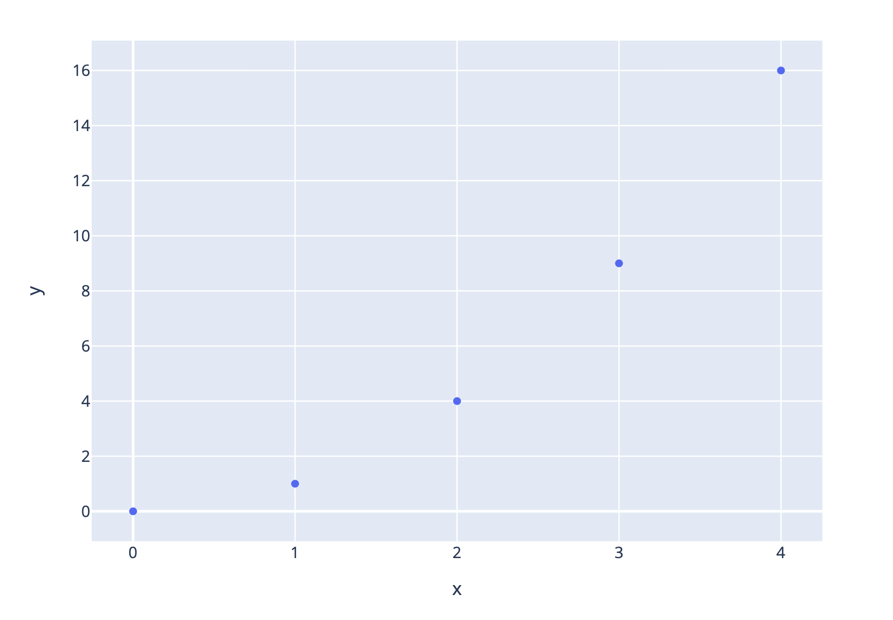
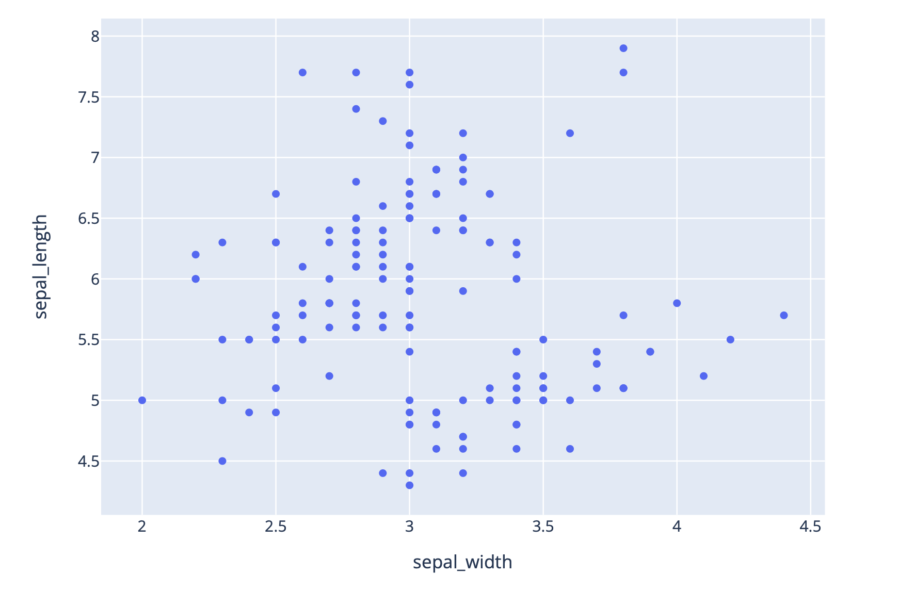
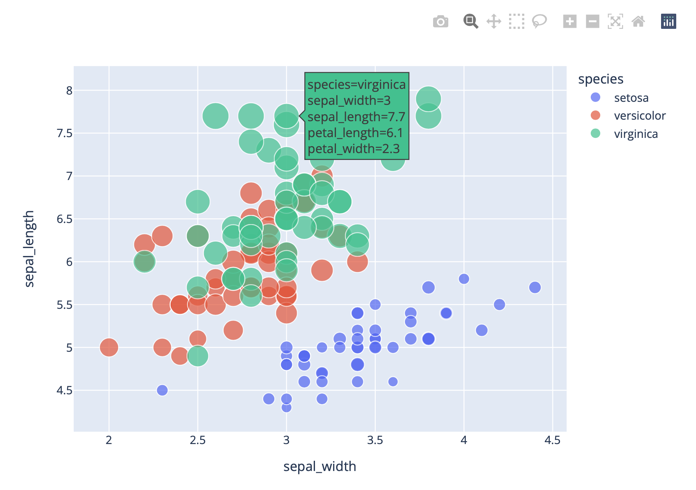
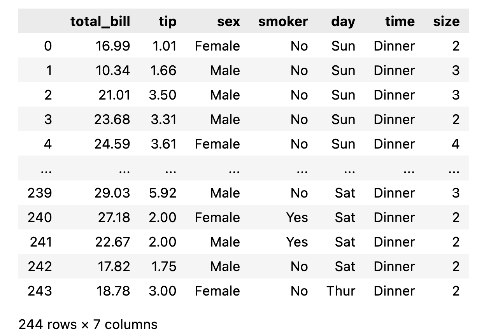
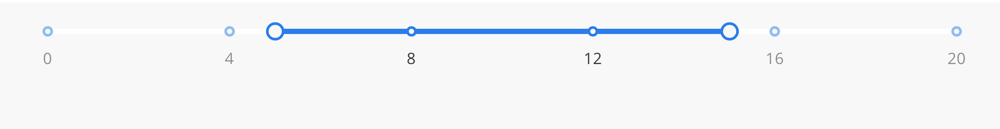
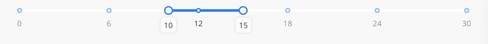

## Scater和RangeSlider
- 以點表示的圖表

```python
import plotly.express as px
fig = px.scatter(x=[0,1,2,3,4], y=[0,1,4,9,16])
fig.show()
```



```python
#x and y使用DataFrame Columns
import plotly.express as px
df = px.data.iris()
fig = px.scatter(df, x = 'sepal_width', y='sepal_length')
fig.show()
```




## 設定點大小和顏色

```python
import plotly.express as px
df = px.data.iris()
fig = px.scatter(df,
                x="sepal_width",
                y="sepal_length",
                color="species",
                size="petal_length",
                hover_data=['petal_width']
)
fig.show()
```



```python
import plotly.express as px
df = px.data.iris()
fig = px.scatter(df,
                 x="sepal_width",
                 y="sepal_length",
                 color="petal_length"
)
fig.show()
```


###  symbol argument

```python
import plotly.express as px
pd = px.data.iris()
fig = px.scatter(df,
                 x="sepal_width",
                 y="sepal_length",
                 color="species",
                 symbol="species"
)

fig.show()
```


### 支援trendlind
- pip install statsmodels

```python
import plotly.express as px

df = px.data.tips()
fig = px.scatter(df,
                 x="total_bill",
                 y="tip",
                 trendline="ols"
)
fig.show()
```




### RangerSlider
- dcc.RangeSlider

```python
from dash import Dash, html, dcc, Input, Output

external_stylesheets = ['https://codepen.io/chriddyp/pen/bWLwgP.css']
app = Dash(__name__,external_stylesheets=external_stylesheets)
app.layout = html.Div([
    dcc.RangeSlider(0, 20, 1, value=[5, 15], id='my-range-slider'),
    html.Div(id='output-container-range-slider')
])

@app.callback(
    Output('output-container-range-slider','children'),
    Input('my-range-slider','value')
)
def update_output(value):
    return "you have selected '{}'".format(value)

if __name__ == '__main__':
    app.run_server(debug=True)

```


#### Min, Max, Step

```python
dcc.RangeSlider(min=0, max=20, step=1, value=[5, 15], id='my-range-slider')
```

#### Marks and Steps

- Marks 在Dash >= 2.1版後會自動產生

#### Auto Generated Marks
- 沒有設定step,則step會自動設定

```python
dcc.RangeSlider(0, 20, value=[5, 15])
```



#### Turn off Marks

```python
dcc.RangeSlider(0, 20, marks=None, value=[5, 15])
```


#### 自訂的Custom Marks

```python
dcc.RangeSlider(
    min=0,
    max=10,
    step=None,
    marks={
        0: '0°F',
        3: '3°F',
        5: '5°F',
        7.65: '7.65°F',
        10: '10°F'
    },
    value=[3, 7.65]
)
```

#### Included and Styling Marks

```python
# RangeSlider has included=True by default
dcc.RangeSlider(0, 100, value=[10, 65], marks={
        0: {'label': '0°C', 'style': {'color': '#77b0b1'}},
        26: {'label': '26°C'},
        37: {'label': '37°C'},
        100: {'label': '100°C', 'style': {'color': '#f50'}}
    }
)
```


#### Tooltips

```python
dcc.RangeSlider(0, 30, value=[10, 15],
                tooltip={"placement": "bottom", "always_visible": True})
```



### 整合dash

```python
from dash import Dash, dcc, html, Input, Output
import plotly.express as px

app = Dash(__name__)

app.layout = html.Div([
    html.H4("Interactive scatter plot with Iris dataset"),
    dcc.Graph(id="scatter-plot"),
    html.P("Filter by petal width:"),
    dcc.RangeSlider(
        id="ranger-slider",
        min=0, max=2.5, step=0.1,
        marks={0:'0',2.5:'2.5'},
        value=[0.5, 2]
    )
])

@app.callback(
    Output("scatter-plot","figure"),
    Input("ranger-slider","value")
)
def update_bar_chart(slider_range):
    df = px.data.iris()
    low, high = slider_range
    mask = (df['petal_width'] > low) & (df['petal_width'] < high)
    fig = px.scatter(
        df[mask],
        x="sepal_width",
        y="sepal_length",
        color="species",
        size="petal_length",
        hover_data = ["petal_width"]

    )
    return fig

app.run_server(debug=True)
```


