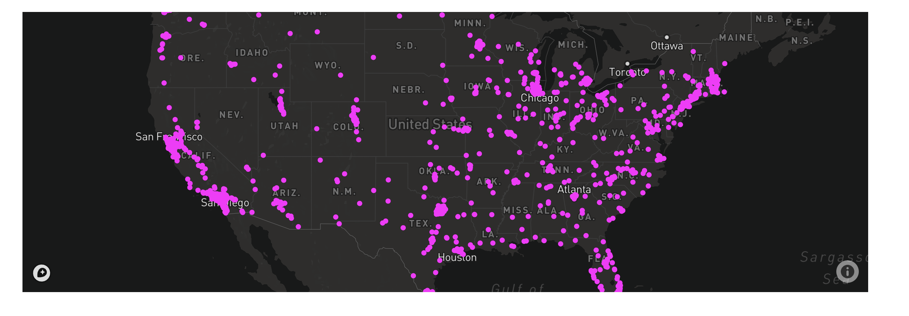
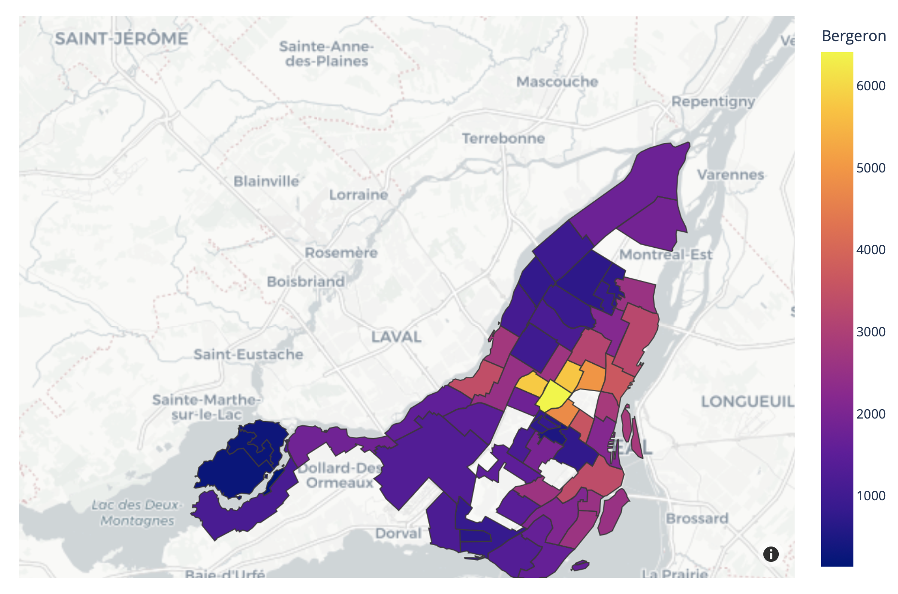
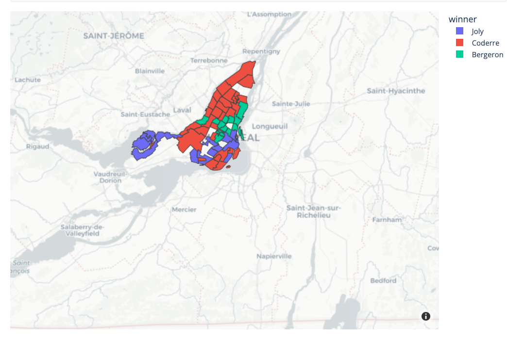

## 分級著色圖(Choropleth Map)
- 使用顏色分級
### 支援
- Mapbox Maps
- Geo maps

### [Mapbox Maps](https://mapbox.com/)
- tile-base maps

#### Mapbox Maps支援的圖表
- px.scatter_mapbox
- px.line_mapbox
- px.choropleth_mapbox
- px.density_mapbox
- go.Scattermapbox
- go.Choroplethmapbox
- go.Densitymapbox

#### 使用Mapbox Map有時而要申請免費的Mapbox token
- 如果基礎地圖有參考到(layout.mapbox.style)Mapbox service就要申請
- 如果沒有參考到Mapbox service就可以不用申請

#### 基礎地圖(layout.mapbox.style)
##### 不需要token
- white-bg
- open-street-map
- carto-positron
- carto-darkmatter
- stamen-terrain
- stamen-toner
- stamen-watercolor

##### 需要token
- basic
- streets
- outdoors
- light
- dark
- satellite
- satellite-streets

#### OpenStreetMap-不需要token

```python
import pandas as pd
us_cities = pd.read_csv("https://raw.githubusercontent.com/plotly/datasets/master/us-cities-top-1k.csv")

import plotly.express as px

fig = px.scatter_mapbox(us_cities, lat="lat", lon="lon", hover_name="City", hover_data=["State", "Population"],
                        color_discrete_sequence=["fuchsia"], zoom=3, height=300)
fig.update_layout(mapbox_style="open-street-map")
fig.update_layout(margin={"r":0,"t":0,"l":0,"b":0})
fig.show()
```


#### dark-需要token
- 使用"drak"
- token檔內不需要有字串

```python
token = open("mapbox_token").read() # you will need your own token

import pandas as pd
us_cities = pd.read_csv("https://raw.githubusercontent.com/plotly/datasets/master/us-cities-top-1k.csv")

import plotly.express as px

fig = px.scatter_mapbox(us_cities, lat="lat", lon="lon", hover_name="City", hover_data=["State", "Population"],
                        color_discrete_sequence=["fuchsia"], zoom=3, height=300)
fig.update_layout(mapbox_style="dark", mapbox_accesstoken=token)
fig.update_layout(margin={"r":0,"t":0,"l":0,"b":0})
fig.show()
```




### Geo maps
- outline-base maps

#### Geo maps支援的圖表
- px.scatter_geo
- px.line_geo
- px.choropleth
- go.Scattergeo
- go.Choropleth


### 使用GeoJSON
- 使用json內一個key當索引
- featureidKey

```python
import plotly.express as px

df = px.data.election()
geojson = px.data.election_geojson()

print(df["district"][2])
print(geojson["features"][0]["properties"])
```


```python
import plotly.express as px

df = px.data.election()
geojson = px.data.election_geojson()

fig = px.choropleth_mapbox(df, geojson=geojson, color="Bergeron",
                           locations="district", featureidkey="properties.district",
                           center={"lat": 45.5517, "lon": -73.7073},
                           mapbox_style="carto-positron", zoom=9)
fig.update_layout(margin={"r":0,"t":0,"l":0,"b":0})
fig.show()
```



## Dash

```python
from dash import Dash, dcc, html, Input, Output
import plotly.express as px

token = open("mapbox_token").read()
app = Dash(__name__)

app.layout = html.Div([
    html.H4('Polotical candidate voting pool analysis'),
    html.P("Select a candidate:"),
    dcc.RadioItems(
        id='candidate',
        options = ["Joly", "Coderre", "Bergeron"],
        value="Coderre",
        inline=True
    ),
    dcc.Graph(id="graph")
])

@app.callback(
    Output("graph","figure"),
    Input("candidate","value")
)
def display_choropleth(candidate):
    df = px.data.election()
    geojson = px.data.election_geojson()
    fig = px.choropleth_mapbox(
        df,
        geojson=geojson,
        color=candidate,
        locations="district",
        featureidkey="properties.district",
        center={"lat":45.5517, "lon":-737073},
        zoom=9,
        range_color=[0, 6500]
    )

    fig.update_layout(
        margin={"r":0, "t":0, "l":0, "b":0},
        mapbox_accesstoken = token
    )

    return fig

app.run_server(debug=True)


```


### 用顏色分隔

- color要對到非數值的欄位值

```python
import plotly.express as px

df = px.data.election()
geojson = px.data.election_geojson()

fig = px.choropleth_mapbox(df, geojson=geojson, color="winner",
                           locations="district", featureidkey="properties.district",
                           center={"lat": 45.5517, "lon": -73.7073},
                           mapbox_style="carto-positron", zoom=9)
fig.update_layout(margin={"r":0,"t":0,"l":0,"b":0})
fig.show()
```


