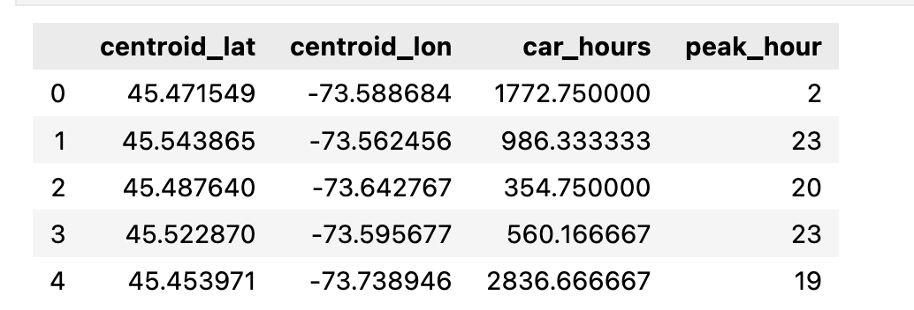
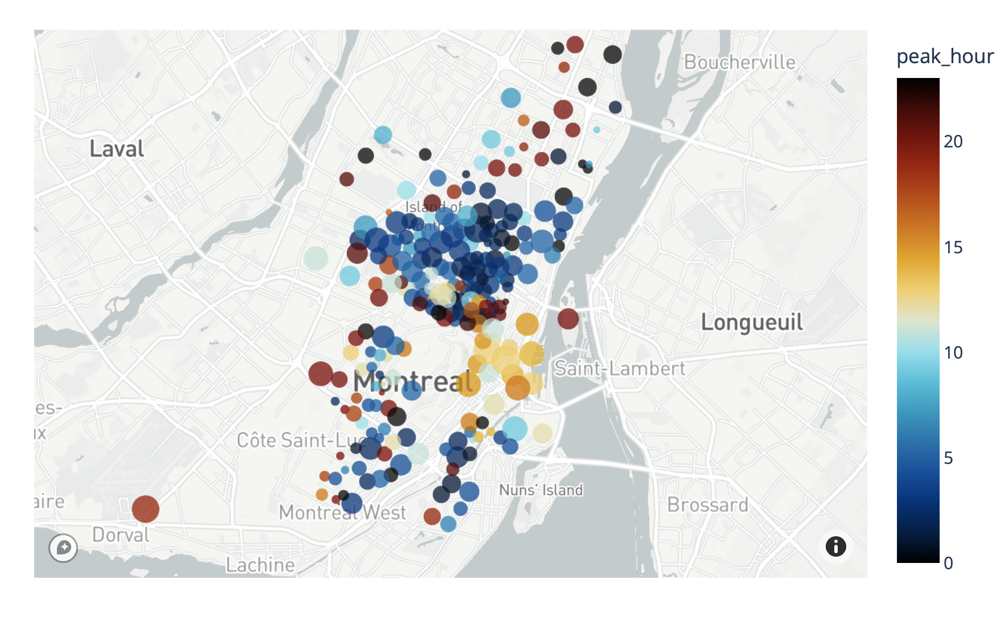
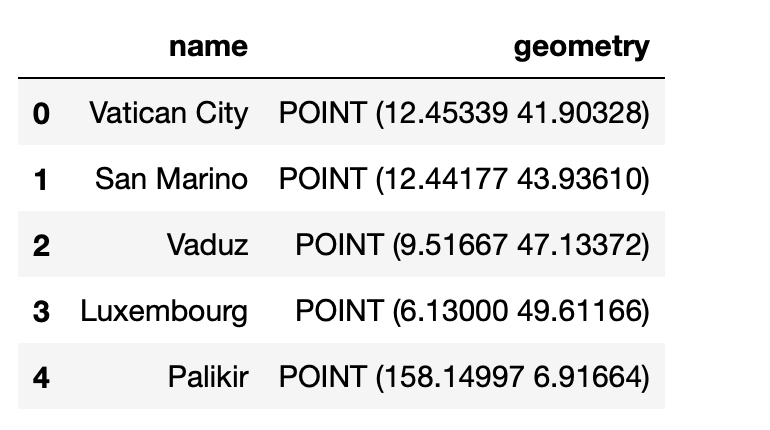
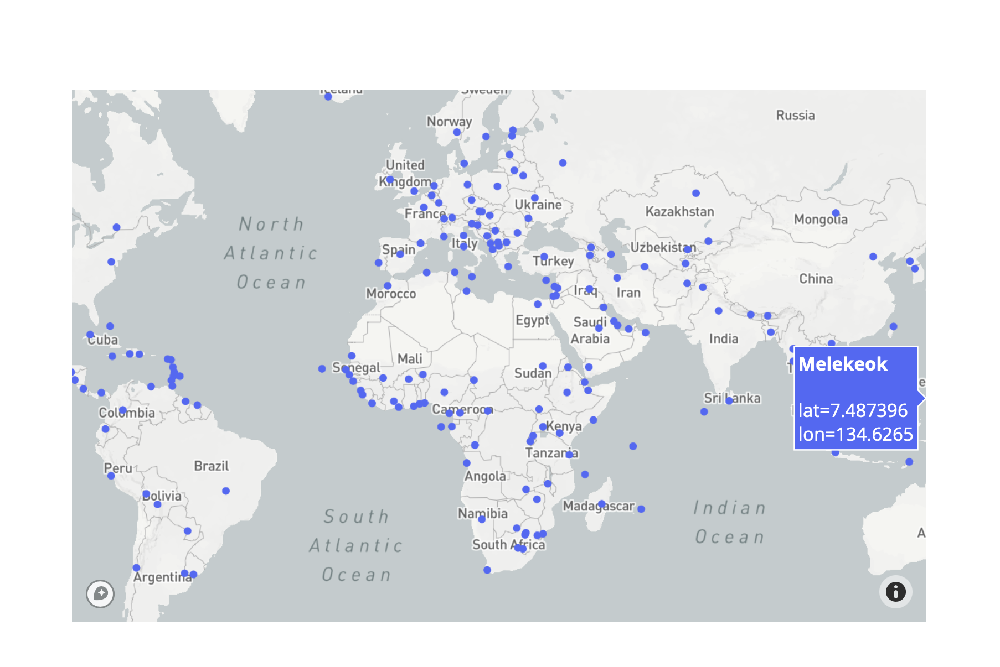

# Scatter Plots on Mapbox
- px.scatter_mapbox

## 基本的scatter_mapbox

```python
import plotly.express as px
px.set_mapbox_access_token(open("../mapbox_token").read())
df = px.data.carshare()
fig = px.scatter_mapbox(
    df,
    lat="centroid_lat",
    lon="centroid_lon",
    color="peak_hour",
    size="car_hours",
    color_continuous_scale=px.colors.cyclical.IceFire,
    size_max=15,
    zoom=10
)
fig.show()
```




## 使用GeoPandas

```python
import plotly.express as px
import geopandas as gpd

geo_df = gpd.read_file(gpd.datasets.get_path('naturalearth_cities'))

px.set_mapbox_access_token(open(".mapbox_token").read())
fig = px.scatter_mapbox(geo_df,
                        lat=geo_df.geometry.y,
                        lon=geo_df.geometry.x,
                        hover_name="name",
                        zoom=1)
fig.show()
```



