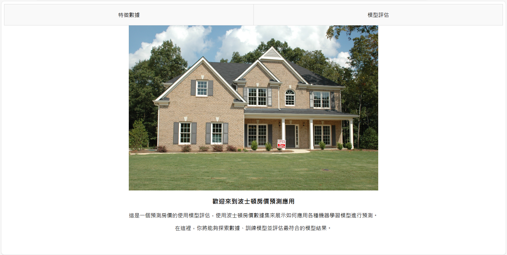
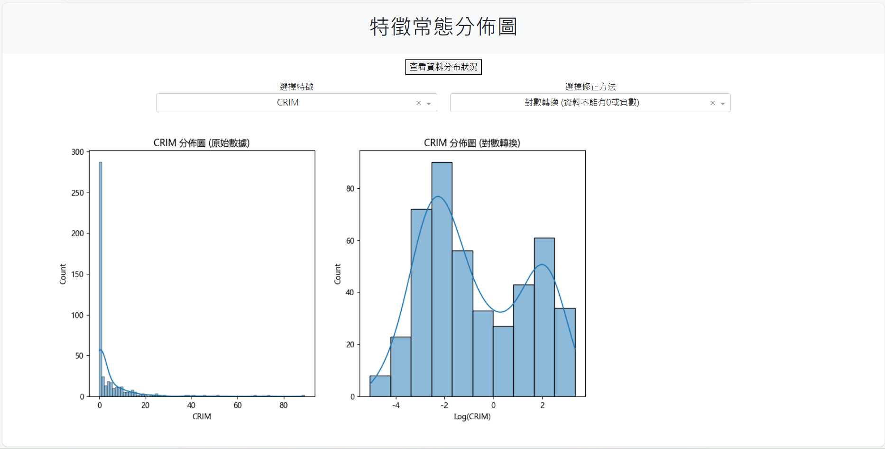
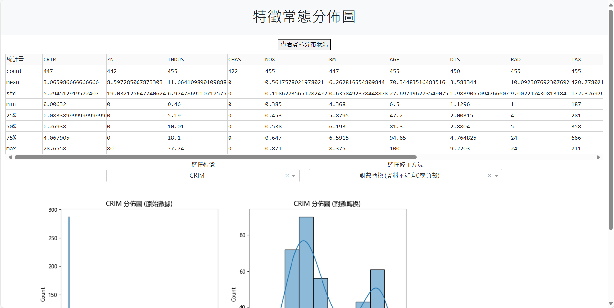
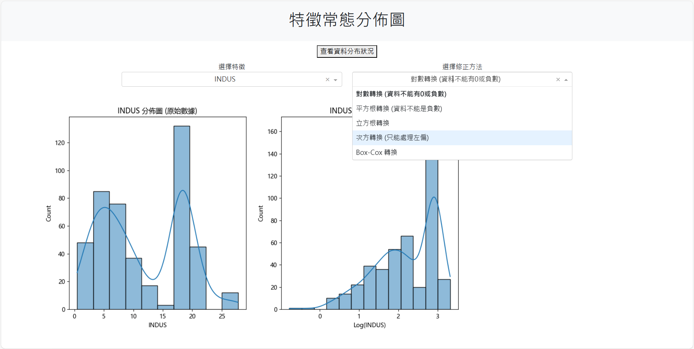
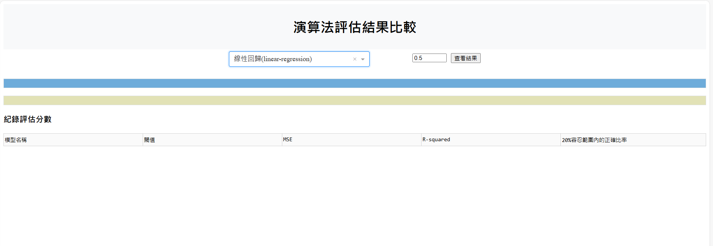
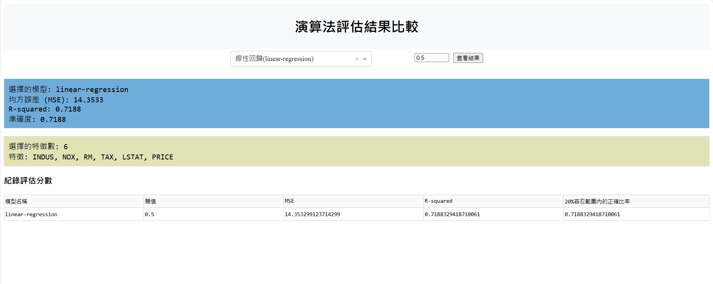
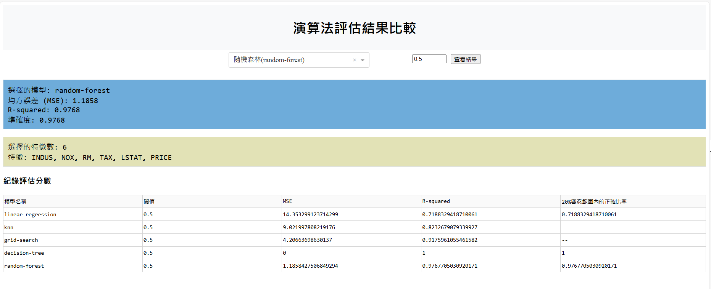

## 波士頓房價預測 dash_flask_web

[Render 網址](https://ted-window-1.onrender.com)

### 資料來源:
原先在Scikit-Learn的Bostion Housing Dataset(現在已經下架)的train_dataset(訓練集)。

### 專案目的: 
以波士頓房價訓練集，體驗監督式學習的分類法，將資料區分為測試和訓練的資料堆，從訓練的資料中定義特徵變數的欄位作為x，房價欄位作為y，找出x和y之間的關係，並把這個關係用測試的資料做驗證，評估模型分數得出預測房價最符合的模型。

### 視窗介面:

### 1.初始畫面

### 2.特徵數據

### 3.選單查看敘述統計

### 4.選擇不同的離群值修正方法

### 5.模型評估介面

### 6.選擇模型種類

可以選擇不同模型與輸入閾值得到模型結果

### 7.紀錄數據

用來記錄使用者查詢的模型評估，當超過5筆資料會自動刪除

### 補充說明:
我的機器學習專案流程分成7個步驟，以下為上述圖片內容的步驟說明:  
1.收集資料，彙整為資料集(Dataset)。來自於原先在Scikit-Learn的Bostion Housing Dataset(現在已經下架)的train_dataset(訓練集)。  

2.資料清理(Data Cleaning)、資料探索與分析(Exploratory Data Analysis, EDA)：EDA通常是以描述統計量及統計圖觀察資料的分佈，瞭解資料的特性、極端值(Outlier)、變數之間的關聯性。  

3.特徵工程(Feature Engineering)：原始蒐集的資料未必是影響預測目標的關鍵因素，有時候需要進行資料轉換，以找到關鍵的影響變數。

4.資料切割(Data Split)：切割為訓練資料(Training Data)及測試資料(TestData)，一份資料提供模型訓練之用，另一份資料則用在衡量模型效能，例如準確度，切割的主要原因是確保測試資料不會參與訓練，以維持其公正性，即Out-of-Sample Test。

5.選擇演算法(Learning Algorithms)：依據問題的類型選擇適合的演算法。

6.模型訓練(Model Training)：以演算法及訓練資料，進行訓練產出模型。

7.模型評分(Score Model)：計算準確度等效能指標，評估模型的準確性。