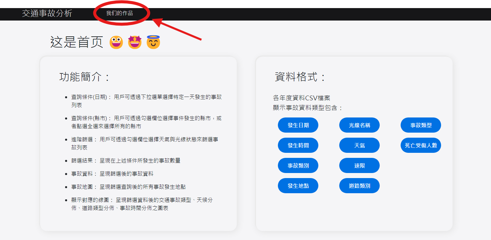
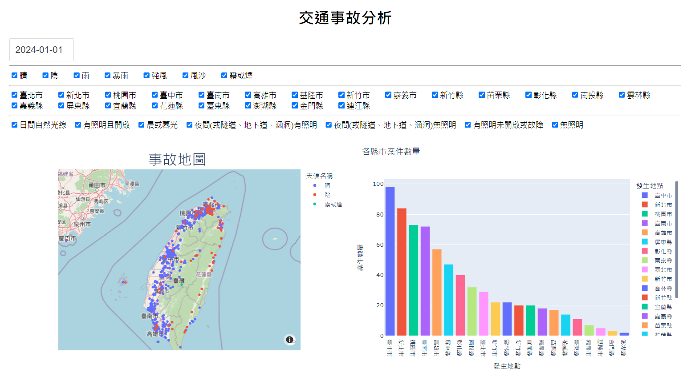
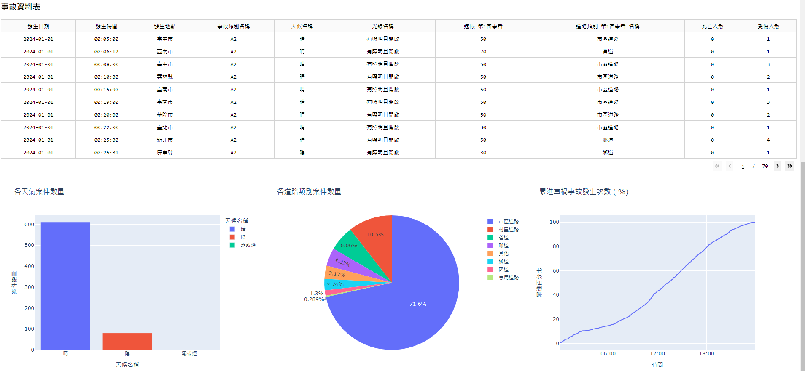

# Python网页专案 -> 使用flask+Dash
## 一、專案主題: 交通事故查詢地圖
## 二、專案小組人員: 04-毛栩櫟、16-陳名畯、19-林佑穎
## 三、專案網址:
https://github.com/mjchen004/python_dash-flask
## 四、目標方法:
### 1.載入單一交通事故的事故資訊
### 2.將事故地點以google地圖圖像化
### 3.交通事故比例分析
## 五、功能簡介:
* 查詢條件(日期):用戶可透過下拉選單選擇特定一天發生的事故列表

* 查詢條件(縣市):用戶可透過勾選欄位選擇事件發生的縣市

* 進階篩選：用戶可透過勾選欄位選擇天氣與光線狀態來篩選事故列表

* 事故地圖：呈現篩選查詢後的所有事故發生地點

* 事故資料：呈現篩選後的事故資料

* 事故分析：呈現篩選查詢結果中，各縣市、各天候類別、各道路類別及各時間段中，事故的發生數比較

## 六、資料來源:
傷亡道路交通事故資料( [政府資料開放平台](https://data.gov.tw/datasets/search?p=1&size=10&s=_score_desc&rft=%E4%BA%A4%E9%80%9A%E4%BA%8B%E6%95%85) )

## 七、程式架構:
### [資料查詢程式設計](./dashboard/dashboard2.py)
### [功能介紹頁面設計](./templates/index.html.jinja)

## 八、資料格式:
* 各年度資料csv檔案，存放於Render的postgreSQL資料庫中
### [建立資料庫](./CreateTable.sql)
### [資料存放](./(mj)translate.ipynb)

* 顯示事故資料類型包含:
  
> 發生日期 | 發生時間 | 發生地點 | 事故類別 | 天氣 | 光線名稱 | 速限 | 道路類別 | 死亡人數 | 受傷人數

1. 進入的第一視窗介面
### 
2. 初步了解後點選_我們的作品_進入交通事故查詢頁面
### 
3. 選擇日期、勾選要呈現的條件後，事故地圖顯示於下方
### 
4. 交通事故之情形分布
### 

# 成果影片連結:
> ## [Youtube連接](https://www.youtube.com/watch?v=HANUxkTxgn4)
