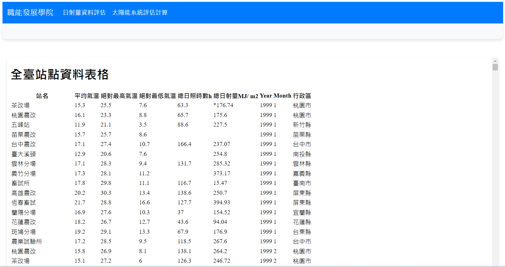
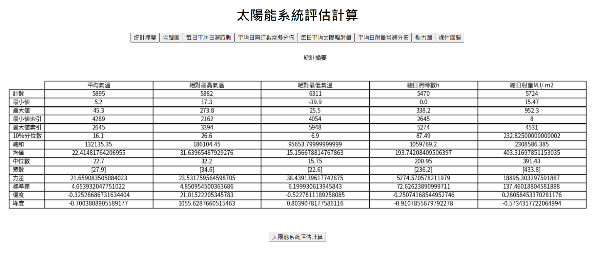
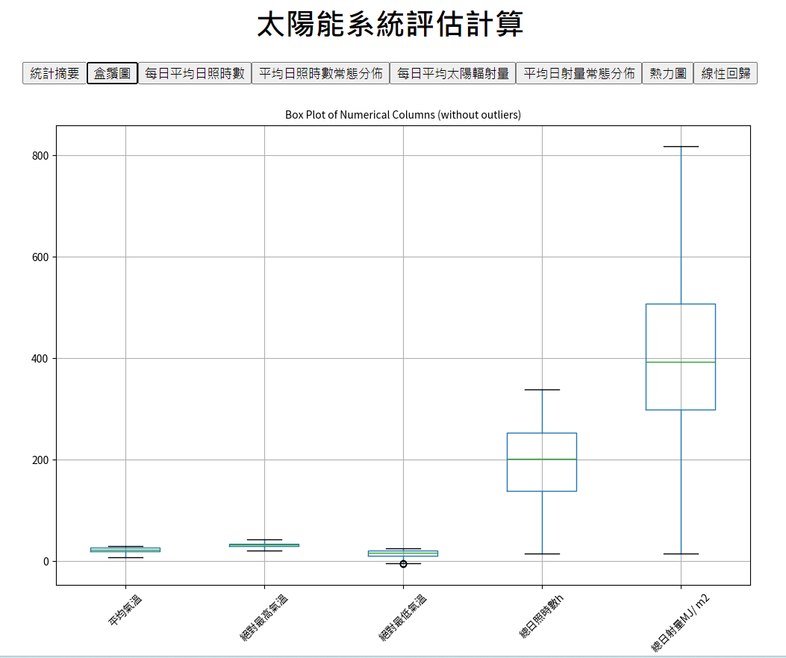
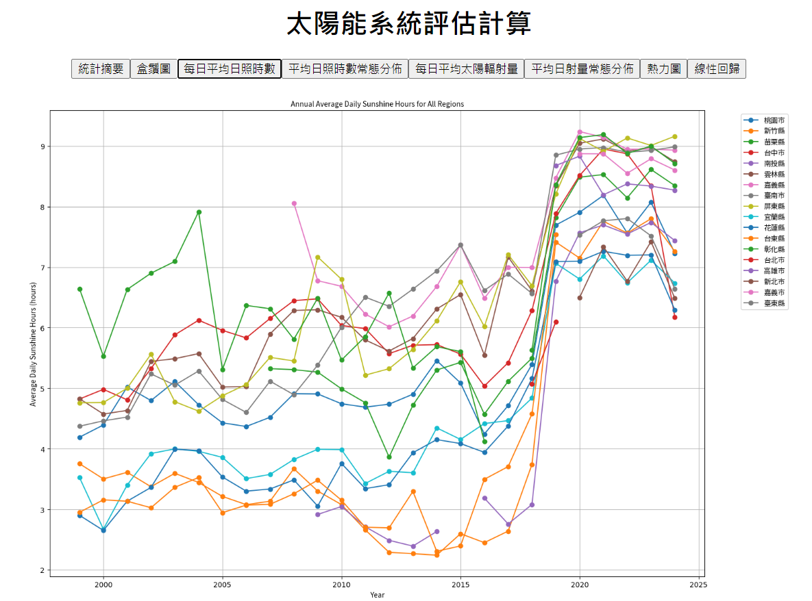
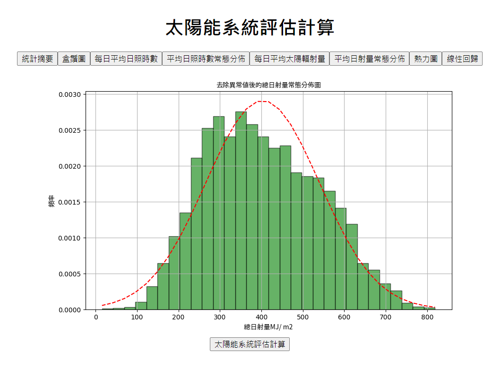
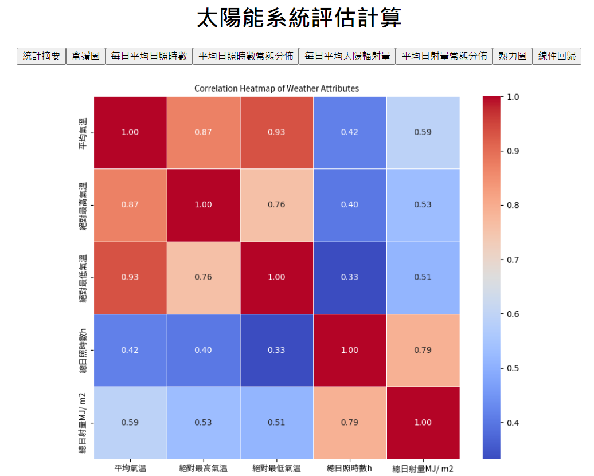
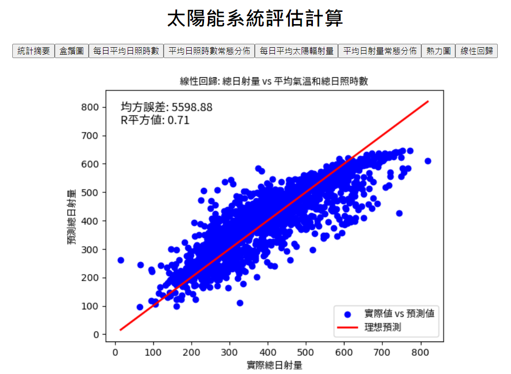

## 一、專案組名： 氣候變遷及太陽能系統建置評估

## 二、專案組員：魏天厚、林宣安

## 三、專案目的：

太陽能系統安裝評估計算

## 四、功能簡述：

>* 展示出目前的資料集資訊。
>* 點擊資訊之後到另一個網頁展示資訊。
>* 新的頁面中有、熱力圖、盒鬚圖、線性回歸等。
>* 模型評估的資訊。

# 成果連結:
> ## [網站連接](https://jasonlin0301-window.onrender.com)

### 此專案提供一個方便簡約的介面

---
# 視窗介面

---
# 結果總攬展示視窗

