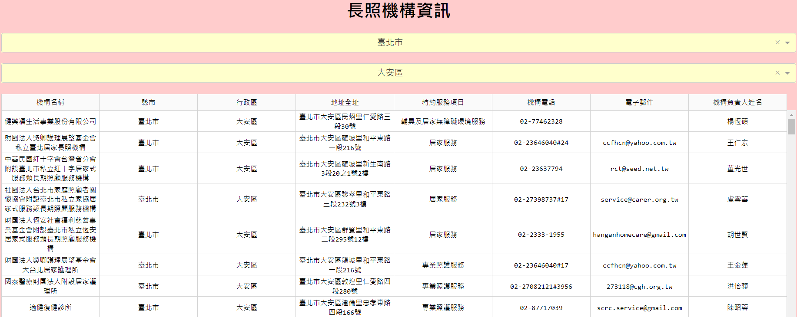
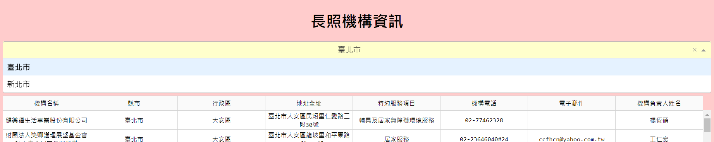
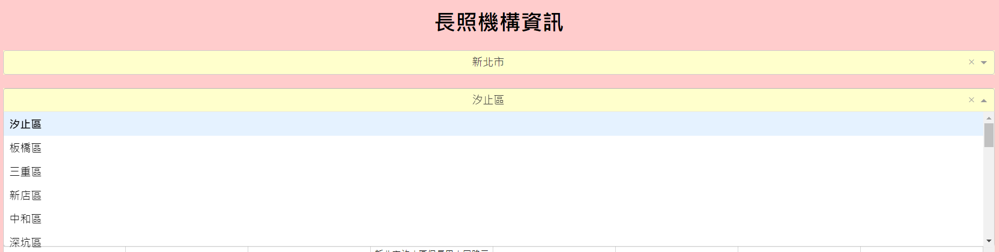

## TVDI_Project_LTC
### 長照(LTC, aka Long-Term Care)

* 小組成員：陳明勝、孫義翔、林重仰
* 專案主題：統整各地長照機構資訊，並用Dash & Flask等展示相關資訊

### 範疇:
* 區域：台北市、新北市
* 資料來源：政府公開資訊
* 基本資料：長照機構總表
* 分工
  *  資料收集：陳明勝 & 孫義翔
  *  程式設計：林重仰
 

## 程式執行後的首頁:

## 有兩種下拉式選單:

