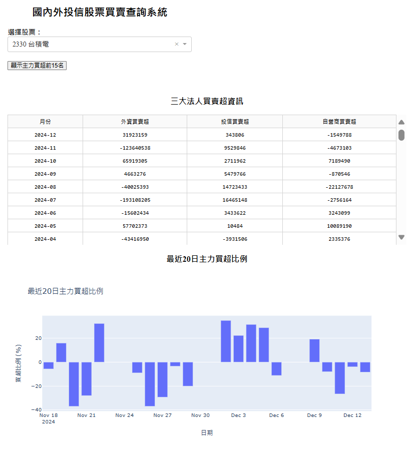
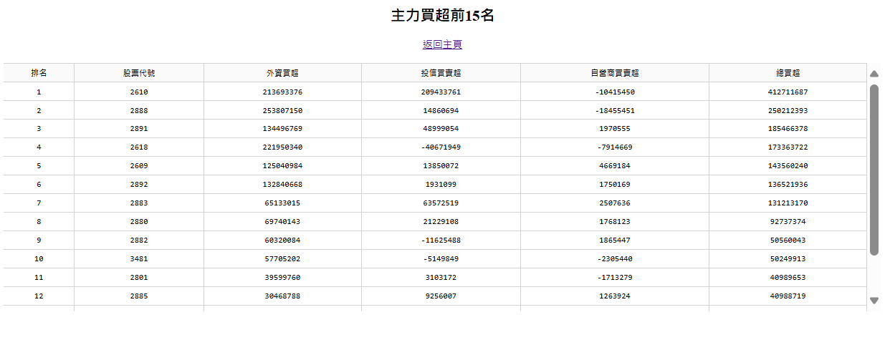

## 三大法人股票買賣超觀察系統

**一、組員：**

陳定康、江榮展

**二、專案網址**

**三、專案目標**

透過觀察三大法人近20日的買賣超資訊、分析三大主力與全股市投資人的買超比例，以及排序出主力買超的前15名股票，提供投資人選股參考。

#### **四、功能概述**

1. 顯示指定股票的月度法人買賣超資料。
2. 視覺化法人買賣超與股價趨勢。
3. 分析三大法人對個股的主力買超比例。
4. 提供近20日法人買超前15名的股票清單。

#### **五、技術架構**

1. 資料來源：

   * 使用 FinLab 的資料 API 獲取法人交易與價格數據。
   * 股票代號清單從本地 Excel 文件讀取。
2. 前端技術：

   * **Dash** : 用於構建前端應用，取代原本的 Tkinter。
   * **Plotly** : 用於繪製動態數據圖表。
   * **Pandas** : 用於數據處理與分析。
3. 環境管理：

   * dotenv 用於讀取 API 金鑰。
   * 本地數據緩存儲存在指定目錄（`data.FileStorage`）。

#### **六、頁面功能說明**

#### **1. 主頁**

* **功能**
  * 使用下拉選單選擇股票。
  * 顯示「三大法人買賣超資訊」表格。
  * 繪製「最近20日主力買超比例」柱狀圖。
  * 點擊按鈕跳轉到「法人買超前15名」頁面。
* **主頁示意**
  

#### **2. 法人買超前15名**

* **功能**
  * 根據最近20日數據，計算法人總買超，顯示前15名股票清單（不重複代號）。
  * 排序方式：總買超由高到低。
* **前15名示意**
  
