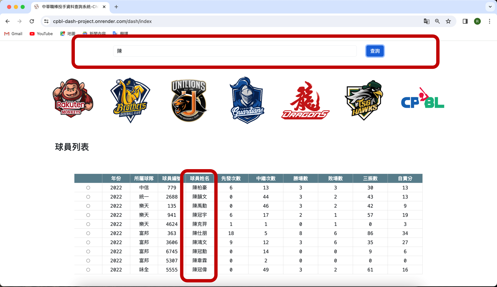

## 中華職棒投手資料查詢網頁

### 一、專題組員：葉俐彤 Rachel Yeh

### 二、專案目的：

     - 提供關注中華職棒的使用者，透過網頁快速查詢各投手數據
     - 透過Dash將數據資料圖表視覺畫呈現，讓投手成績的數據更容易閱讀
     - 透過Python結合Ploty、Dash製作內容、PostgreSQL，並將網頁及資料庫實際上架至Render

### 三、程式集：
    - 程式集：
        1.  main.py（主執行檔，server的網址建立與設定）
        2.  cpbl_datasource.py (PostgreSQL資料庫連線及查詢、圖片顯示編碼轉換等的方法)
        3.  dash_app1.py-dash_app6.py （各分頁的Layout及Callback設定）
        4.  pitchings_2022_updated.csv （資料檔，透過爬蟲方式抓取資料並整理成csv檔）
        5.  樣式設定檔案
    
    - 使用軟體及套件關鍵字：Python、Ploty、Dash、Html、css、PostgreSQL、Render

### 四、專案網址：
專案GitHub：[https://github.com/Rachelyah/CPBL_DASH_Project](https://github.com/Rachelyah/CPBL_DASH_Project)

網站網址：[https://cpbl-dash-project.onrender.com/](https://cpbl-dash-project.onrender.com/)

### 五、使用說明：
    
    - 使用方式：透過網頁中的「球員列表」選取球員後，則會顯示「球員詳細資料」，包含球員個人數據及各項進階數據的統計圖表呈現
    
    - 初始畫面/首頁：

    - 搜尋欄位：可以輸入球員姓名關鍵字，更新球員列表名單，找到指定的球員

    - 中職球隊按鈕：點擊後可連結至特定球隊頁面，包含該球隊所有投手的數據及球團主視覺Banner更新

    - 球員詳細資料更新：點擊個別球員後，下方將顯示球員詳細資料：
        1. 球員照片
        2. 個人資料（投打習慣、背號、身高體重、生日、奪三振率、防禦率）
        3. 出場類型（以先發投手及中繼投手出賽的統計及比例分布）
        4. 奪三振率及防禦率（奪三振率及防禦率與聯盟平均之比較，可觀察該投手的成績是否優於聯盟大多數選手）
        5. 年度對戰打者之統計（該年度與每一位打者對戰之結果統計，包含出局、三振、安打、全壘打、保送之統計）

### 六、資料來源：

- [cpbl-opendata-Idkrsi](https://github.com/ldkrsi/cpbl-opendata)：引用網友分享的過往統計數據csv檔(pitchings.csv)

- [中華職棒大聯盟全球資訊網 The Official Site of CPBL](https://www.cpbl.com.tw/)：透過爬蟲抓取球員的基本資料(投打習慣、身高體重、生日、背號、照片等資料)

- [中信兄弟官方網站](https://www.brothers.tw/)：參考球員主視覺及照片等資料

- [統一7-ELEVEn獅官方網站](https://lioncrew.uni-lions.com.tw/)：參考球員主視覺及照片等資料

- [味全龍官方網站WeiChuan Dragons](https://www.wdragons.com/)：參考球員主視覺及照片等資料

- [台鋼雄鷹- TSG Hawks](https://www.tsghawks.com/)：參考球員主視覺及照片等資料

- [icon-icons.com](https://icon-icons.com/icon/baseball-ball/85269)：引用棒球ico圖檔

- [Pexels](https://www.pexels.com/zh-tw/photo/1661950/)：引用首頁主視覺圖檔

