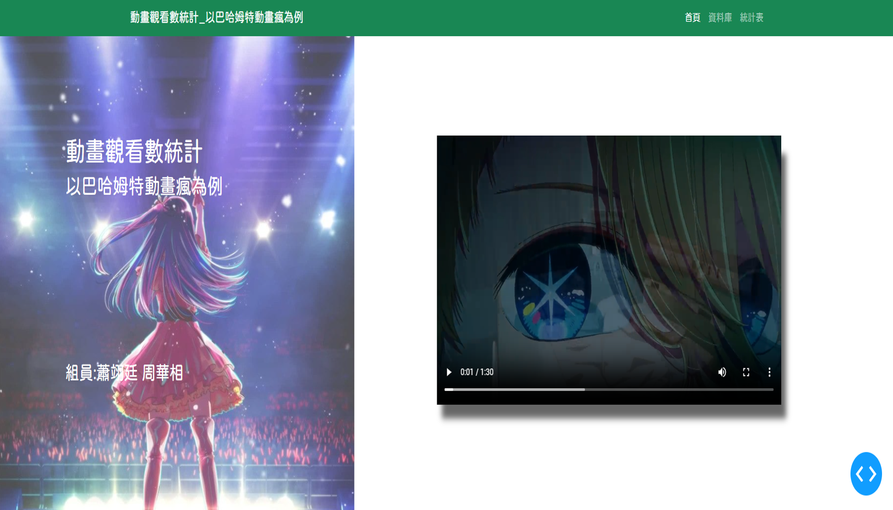
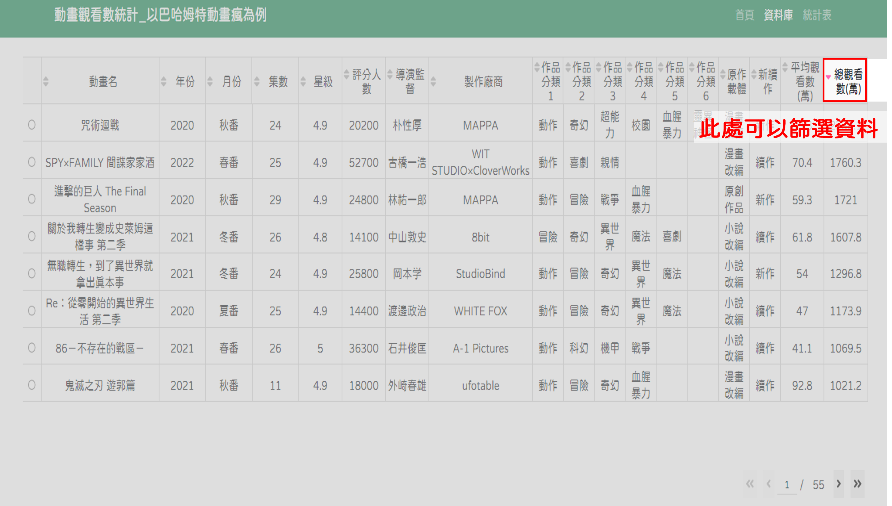
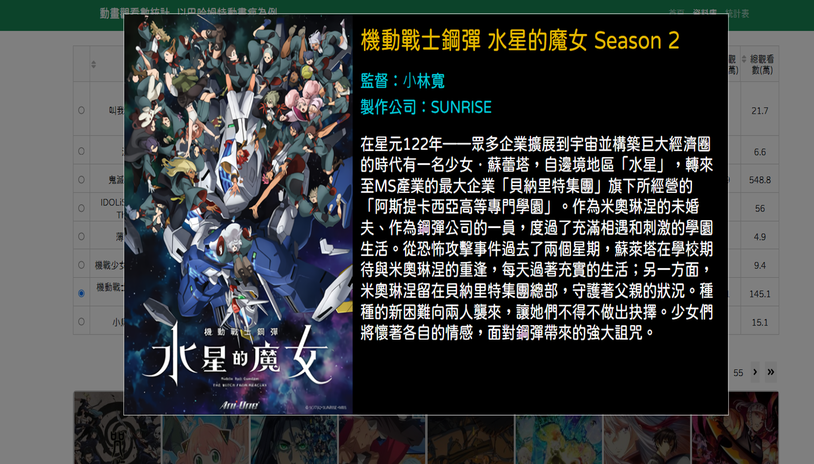
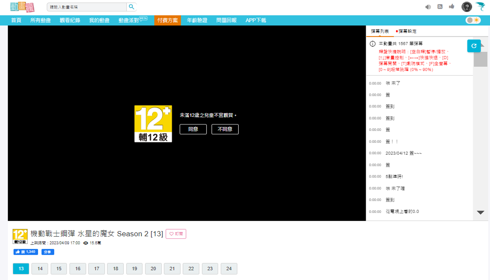
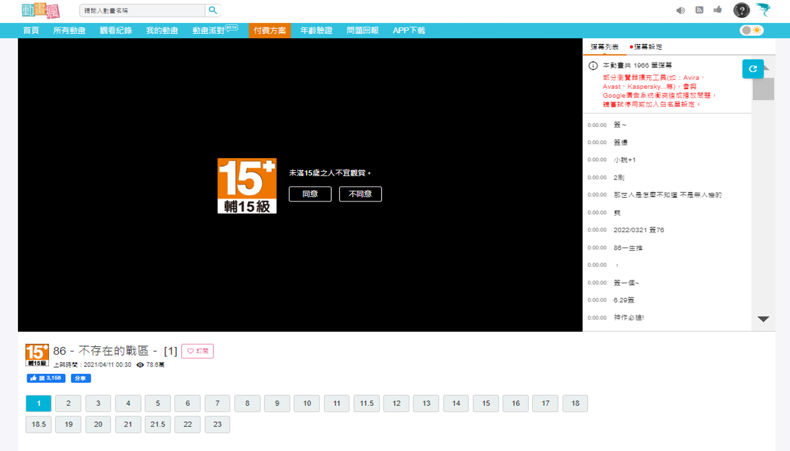
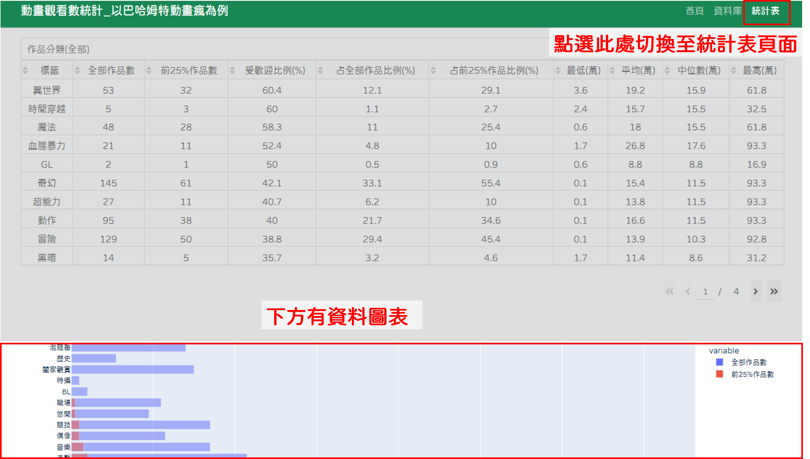
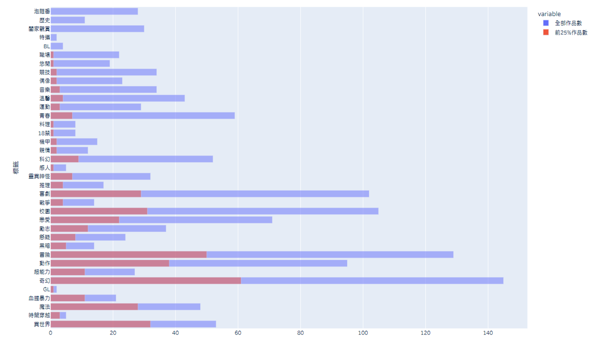
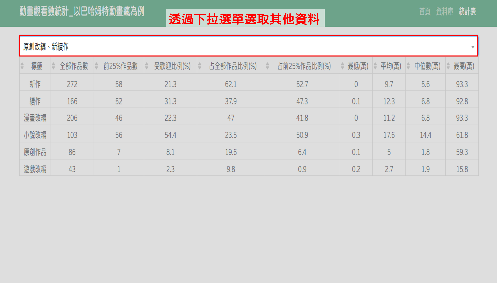
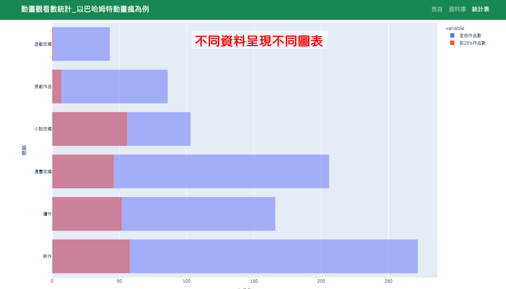
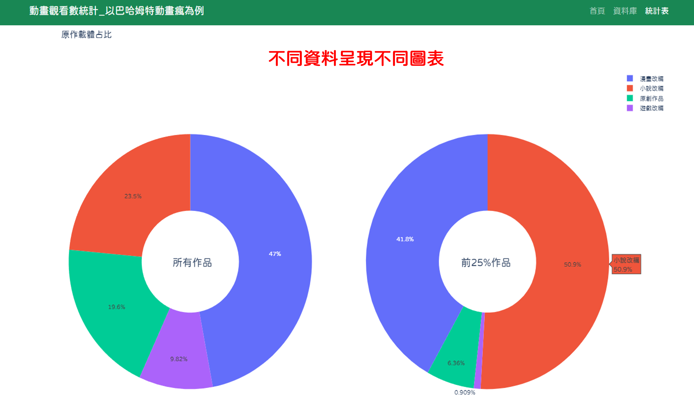

# 動畫觀看數統計_以巴哈姆特動畫瘋為例

## 初始畫面

## 資料庫頁面

## 外部連結至該動畫

## 外部連結至新作介紹

## 統計表頁面

### 一、專案名：動畫觀看數統計_以巴哈姆特動畫瘋為例
### 二、專案組員：蕭翊廷、周華相
### 三、專案網址：
- https://github.com/hsiaoyt0923/Anime_View_Number_Analysis
- https://anime-view-number-analysis.onrender.com/

### 四、專案目的：找出當前熱門題材、發現動畫化作品趨勢
### 五、資料來源：
1. 巴哈姆特動畫平台 https://ani.gamer.com.tw/
2. ACG Secrets https://acgsecrets.hk/

2. 資料範圍：
   - 202001~202306目前尚在巴哈姆特動畫瘋上的動畫。