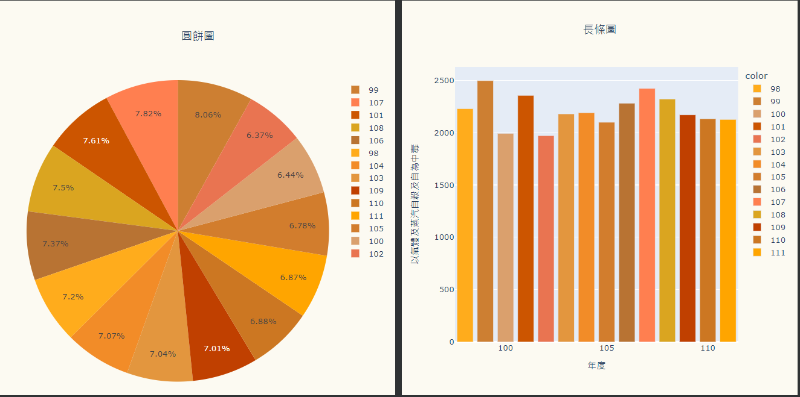

### 組員 何秉哲_陳宇彣_江珮雲

 # 🌸期末網頁報告🌸 #

#### 這是一個可以查看各年度、各種方式自主離世的視覺化圖表網站
###### 資料由98年至111年

# 純粹統計整理，沒有任何建議行為 #

## 網頁展示

# 💐 1. 首頁

# 2. 八個圖示，滑過皆會呈現透明，並顯示文字，點選後會跳轉頁面

# 3. (1)全年度不同方式的圓餅圖、長條圖

#    (2)全資料表格

# 4. (1)上方九個小圖示，對應各種方法

#    (2)滑過呈現半透明，並顯示文字，點選跳轉頁面

# 5. (1)各方法頁面(圓餅圖、長條圖)是彩色的!!🌈🌈🌈

#    (2)視覺化圖表皆互動型

#    (3)折線圖

# 6  (1)左上方有個房子圖示

#    (2)滑過會變大，點選回到主頁

## 影片展示
[VIDEO](https://drive.google.com/file/d/1eTGCMeA-darlGWQZx6rbAgDE1KnfOp4f/view?t=6s)