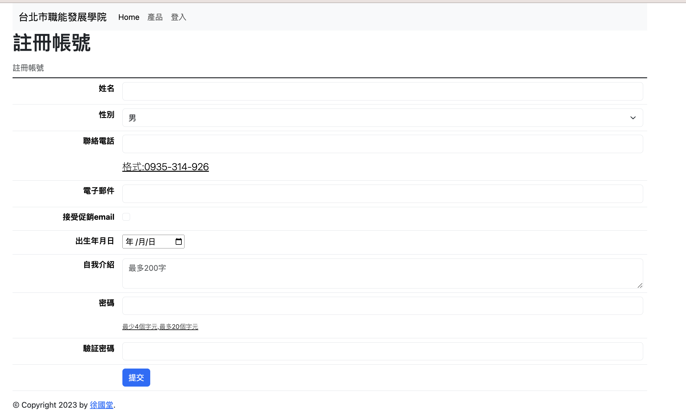
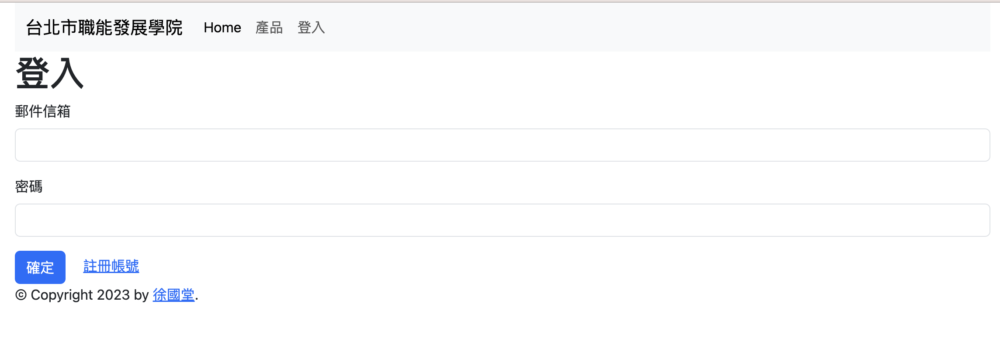
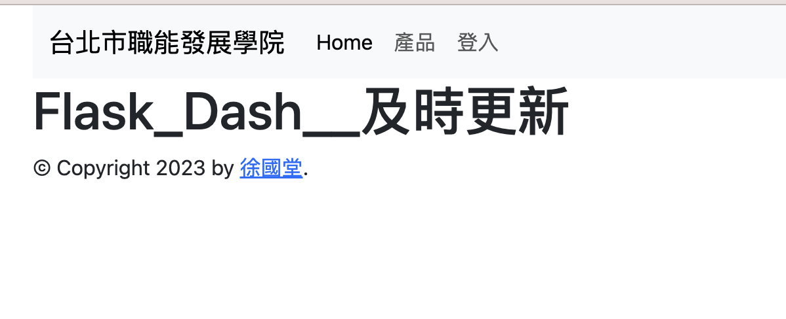
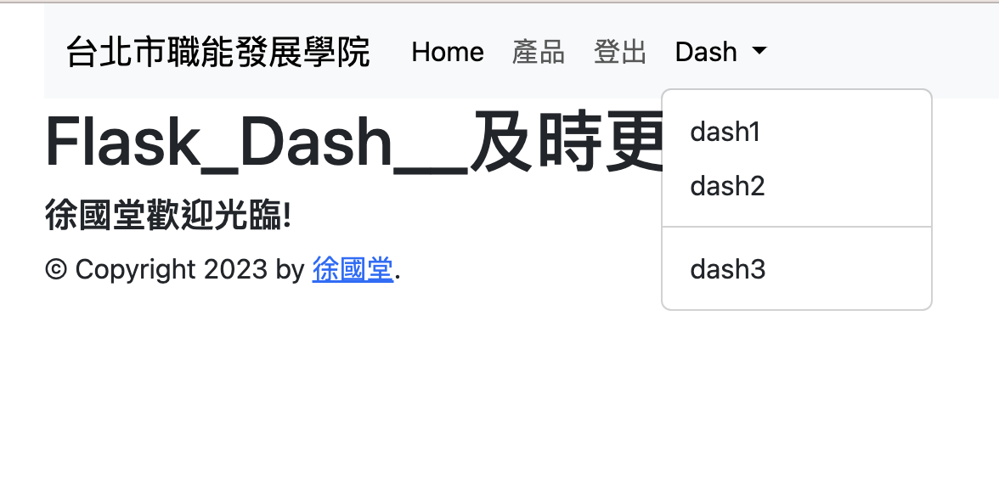
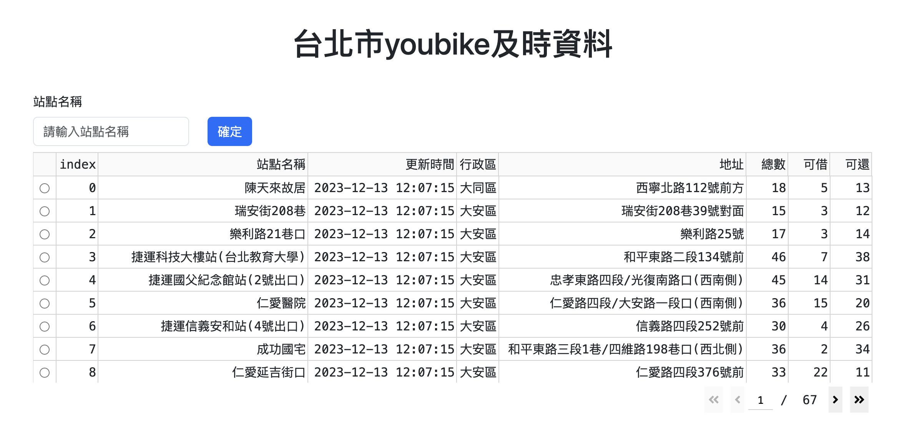

# web 介面
- 注意,flask_dash_web資料夾是部署到render的原始檔
- 使用docker(.devcontainer)
- dash_file資料夾,是專門顯示dash的頁面
- auth資料夾,是專門做註冊,登入,登出的介面

### 1. 使用者註冊介面

### 2. 登入畫面

### 3. 未登入首頁畫面

### 4. 登入首頁畫面

### 5. Dash圖表顯示狀態

### 6. Dash表格顯示

