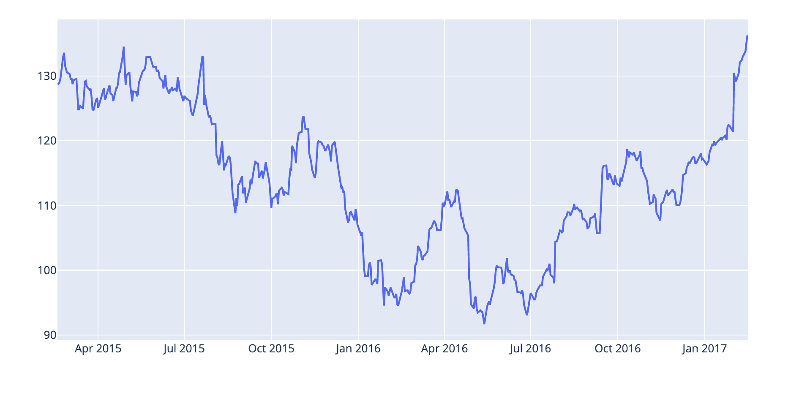

## 時間序列Chart操作
### 支援時間序列操作
- px.line
- px.scatter
- px.bar

### 時間序列格式

- ISO-formatted
- date pandas column
- datetime Numpy Array

```python
import plotly.express as px

df = px.data.stocks()
fig = px.line(df, x='date', y='GOOG')
fig.show()
```


```python
#使用graph_objects

import plotly.graph_objects as go
import pandas as pd

df = pd.read_csv('https://raw.githubusercontent.com/plotly/datasets/master/finance-charts-apple.csv')

fig = go.Figure([
    go.Scatter(x=df['Date'], y=df['AAPL.High'])
])

fig.show()
```



### 使用在Dash

```python
from dash import Dash, dcc, html, Input, Output
import plotly.express as px

app = Dash(__name__)


app.layout = html.Div([
    html.H4('Stock price analysis'),
    dcc.Graph(id="time-series-chart"),
    html.P("Select stock:"),
    dcc.Dropdown(
        id="ticker",
        options=["AMZN", "FB", "NFLX"],
        value="AMZN",
        clearable=False,
    ),
])


@app.callback(
    Output("time-series-chart", "figure"), 
    Input("ticker", "value"))
def display_time_series(ticker):
    df = px.data.stocks() # replace with your own data source
    fig = px.line(df, x='date', y=ticker)
    return fig


app.run_server(debug=True)
```


### 做用barChart

```python
import plotly.express as px

df = px.data.stocks(indexed=True)-1
fig = px.bar(df, x=df.index, y="GOOG")
fig.show()
```


### 使用多面的方式

```python
import plotly.express as px

df = px.data.stocks(indexed=True) - 1
fig = px.area(df, facet_col="company", facet_col_wrap=2)
fig.show()
```


### 自訂tick Labels

```python
import plotly.express as px
df = px.data.stocks()
fig = px.line(df, 
              x="date",
              y=df.columns,
              hover_data={'date':"|%B %d, %Y"},
              title="Custom tick labels"

)

fig.update_xaxes(
    dtick='M1',
    tickformat="%b\n%Y"
)

fig.show()
```


### 移動tick在2個tick之間

```python
import plotly.express as px
df = px.data.stocks()
fig = px.line(df, x="date", y=df.columns,
              hover_data={"date": "|%B %d, %Y"},
              title='custom tick labels with ticklabelmode="period"')
fig.update_xaxes(
    dtick="M1",
    tickformat="%b\n%Y",
    ticklabelmode="period")
fig.show()
```


### 增加次要的tick

```python
import plotly.express as px

df = px.data.stocks()
fig = px.line(df, x='date', y="GOOG")
fig.update_xaxes(
    minor=dict(ticks="inside"),
    showgrid=True
)

fig.show()
```


### 主tick為月份,次tick為周

```python
import pandas as pd
import plotly.express as px

df = pd.read_csv('https://raw.githubusercontent.com/plotly/datasets/master/finance-charts-apple.csv')
df = df.loc[(df["Date"] >= "2016-07-01") & (df["Date"] <= "2016-12-01")]
fig = px.line(df, x="Date", y='AAPL.High')
fig.update_xaxes(
    ticks='outside',
    ticklabelmode='period',
    tickcolor='black',
    ticklen=10,
    minor=dict(
        ticklen=4,
        dtick=7*24*60*60*1000,
        tick0='2016-07-03',
        griddash='dot',
        gridcolor='white'
    )
)

fig.show()
```


### 限定時間範圍的時間序列

```python
#using plotly.express

import plotly.express as px

import pandas as pd
df = pd.read_csv('https://raw.githubusercontent.com/plotly/datasets/master/finance-charts-apple.csv')

fig = px.line(df, x='Date', y='AAPL.High', range_x=['2016-07-01','2016-12-31'])
fig.show()
```


```python
# using graph_objects

import plotly.graph_objects as go
import datetime

x = [datetime.datetime(year=2013, month=10, day=4),
     datetime.datetime(year=2013, month=11, day=5),
     datetime.datetime(year=2013, month=12, day=6)
]

fig = go.Figure(data=[go.Scatter(x=x, y=[1, 3, 6])])
fig.update_layout(xaxis_range=[
    datetime.datetime(2013, 10, 17),
    datetime.datetime(2013, 11, 20)
])
fig.show()
```


### 時間序列和Range Slider

```python
import plotly.express as px
import pandas as pd

df = pd.read_csv('https://raw.githubusercontent.com/plotly/datasets/master/finance-charts-apple.csv')

fig = px.line(df, x='Date', y='AAPL.High', title='Time Series with Rangeslider')

fig.update_xaxes(rangeslider_visible=True)
fig.show()
```


### 時間序列和Range selector Buttons

```python
import plotly.express as px
import pandas as pd

df = pd.read_csv('https://raw.githubusercontent.com/plotly/datasets/master/finance-charts-apple.csv')

fig = px.line(df, x='Date', y='AAPL.High', title='Time Series with Range Slider and Selectors')

fig.update_xaxes(
    rangeslider_visible=True,
    rangeselector=dict(
        buttons=list([
            dict(count=1, label="1m", step="month", stepmode="backward"),
            dict(count=6, label="6m", step="month", stepmode="backward"),
            dict(count=1, label="YTD", step="year", stepmode="todate"),
            dict(count=1, label="1y", step="year", stepmode="backward"),
            dict(step="all")
        ])
    )
)
fig.show()
```


