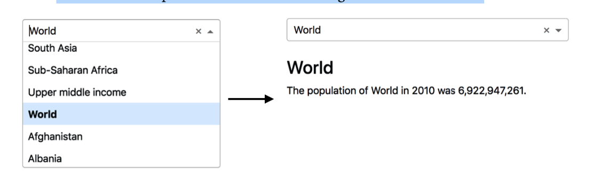

## 利用簡單範例,架構完整dash_app

## 1. 架構Dash app

- 使用jupyter notebooks 執行 Dash app
- 建立純python function
- 了解Dash components的 ID 參數
- 使用Dash輸入和輸出
- 將function整合至app,建立第一個互動程式
- 執行first interactive app

```
pip install jupyter
pip install jupyter_dash==0.4.1  #注意版本
pip install pandas
```

### 使用jupyter notebooks 執行 Dash app

#### 使用lesson1.ipynb
- JupyterDash建立可以在jupyter notebook上可以用的Dash
- 使用dash_core_components的Dropdown建立下拉式元件
- 使用dash_html_component建立html元件


#### 使用lesson1.py 建立下接式表單

#### 建立標準的python function反應Dropdown動作
- lesson2.py
- 必需要有一個參數接收Dropdown傳過來的值

#### Dash components必需要有id引數名稱來做為識別

- lesson2.py

#### Dash input and outputs

- input決定那一個component將成為輸入資料傳遞給function的參數
- output決定function傳出的資料要顯示到那一個component

#### 指定callback function
- @app.callback()

## lesson3.py
- 建立Drop-down元件顯示世界地區名稱
- 建立callback的功能，並計算和過濾出資料
- 顯示選取地區的人口數



### 檢查data資料夾內的檔案

```python
>>> import os
>>> os.listdir('data')

====================================
['lat_long.csv', 'PovStatsSeries.csv', 'poverty.csv', 'PovStatsFootNote.csv', 'PovStatsCountry-Series.csv', 'PovStatsData.csv', 'PovStatsCountry.csv']
```

### 檢查PovStatsData.csv

```python
import pandas as pd
poverty_data = pd.read_csv('data/PovStatsData.csv')
poverty_data.head(3)
```

### 建立pandas DataFrame資料和顯示資料

```python
from dash import Dash,html,dcc
import dash_bootstrap_components as dbc
from dash.dependencies import Output,Input
import pandas as pd
import os


app = Dash(__name__,external_stylesheets=[dbc.themes.DARKLY])
#absfilepath = os.path.abspath('data/PovStatsData.csv')
poverty_data = pd.read_csv('PovStatsData.csv')
app.layout = html.Div([
                html.H1('Poverty And Equity Database'),
                html.H2('The World Bank'),
                dcc.Dropdown(
                    id='country',
                    options=[{'label':country, 'value':country} for country in poverty_data['Country Name'].unique()]
                ),
                html.Br(),
                html.Div(id='report'),
                html.Br(),
                dbc.Tabs([
                    dbc.Tab([
                        html.Ul([
                            html.Br(),
                            html.Li("Number of Economies:170"),
                            html.Li('Temporal Coverage:1974 - 2019'),
                            html.Li('Update Frequency:Quarterly'),
                            html.Li('Last Update: March 18, 2020'),
                            html.Li([
                                'Source: ',
                                html.A('https://datacatalog.worldbank.org/dataset/poverty-and-equity-database',
                                    href='https://datacatalog.worldbank.org/dataset/poverty-and-equity-database'
                                )
                            ])
                        ])
                    ],label='Key Facts'),
                    dbc.Tab([
                        html.Ul([
                            html.Br(),
                            html.Li('Book title: Interactive Dashboards and Data Apps with Plotly and Dash'),
                            html.Li([
                                'GitHub repo: ',
                                html.A('https://github.com/PacktPublishing/Interactive-Dashboards-and-Data-Apps-with-Plotly-and-Dash',
                                    href='https://github.com/PacktPublishing/Interactive-Dashboards-and-Data-Apps-with-Plotly-and-Dash'
                                )
                            ])
                        ])
                    ], label='Project Info')
                ])
             ])

@app.callback(Output('report','children'),
              Input('country','value'))
def display_country_report(country):
    if country is None:
        return ''
    
    filtered_df = poverty_data[(poverty_data['Country Name'] == country) &
                               (poverty_data['Indicator Name'] == 'Population, total')
                              ]
    population = filtered_df.loc[:,'2010'].values[0]
    return [html.H3(country),
            f'The population of {country} in 2010 was {population:,.0f}.']

if __name__ == '__main__':
    app.run_server(debug=True)


```


	
	
	