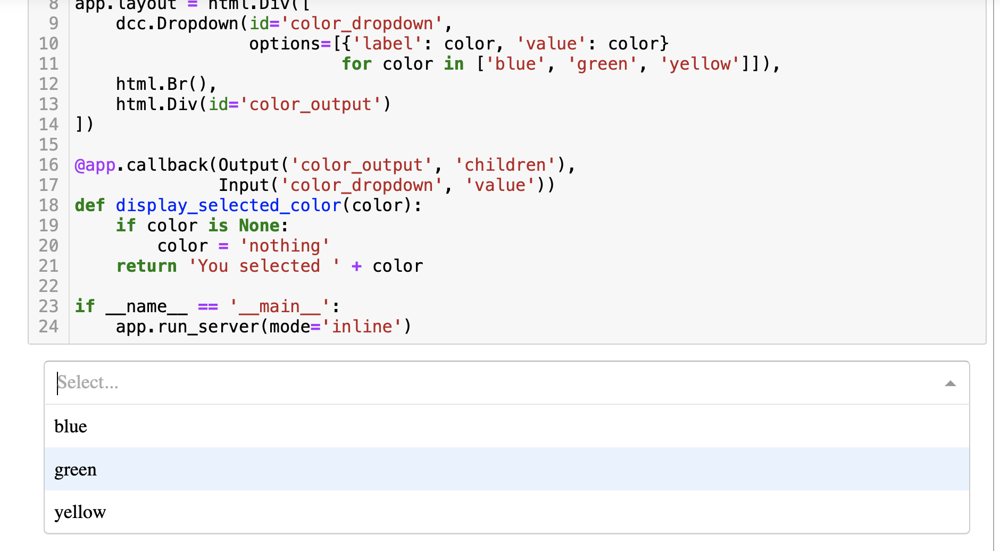

## 1. 架構Dash app

- 使用jupyter notebooks 執行 Dash app
- 建立純python function
- 了解Dash components的 ID 參數
- 使用Dash輸入和輸出
- 將function整合至app,建立第一個互動程式
- 執行first interactive app

```
pip install jupyter
pip install jupyter_dash==0.4.1  #注意版本
pip install pandas
```

### 使用jupyter notebooks 執行 Dash app

#### - 使用lesson1.ipynb
- JupyterDash建立可以在jupyter notebook上可以用的Dash
- 使用dash_core_components的Dropdown建立下拉式元件
- 使用dash_html_component建立html元件




#### 建立標準的python function反應Dropdown動作

- 必需要有一個參數接收Dropdown傳過來的值

#### Dash components必需要有id引數名稱來做為識別

#### Dash input and outputs
- input決定那一個component將成為輸入資料傳遞給function的參數
- output決定function傳出的資料要顯示到那一個component

#### 指定callback function
- @app.callback()

## lesson2.ipynb
- 建立Drop-down元件顯示世界地區名稱
- 建立callback的功能，並計算和過濾出資料
- 顯示選取地區的人口數

### 檢查data資料夾內的檔案

```python
import os
os.listdir('data')
```

### 建立pandas DataFrame資料和顯示資料

```python
from jupyter_dash import JupyterDash
from dash import html
from dash import dcc
from dash.dependencies import Output, Input

app = JupyterDash(__name__)
app.layout = html.Div([
    dcc.Dropdown(id='country',
                 options=[{'label':country, 'value':country} for country in poverty_data['Country Name'].unique()]
                ),
    html.Br(),
    html.Div(id='report')
    
])

@app.callback(Output('report','children'),
            Input('country','value'))
def display_country_report(country):
    if country is None:
        return ''
    
    filtered_df = poverty_data[(poverty_data['Country Name'] == country) & (poverty_data['Indicator Name'] == 'Population, total')]
    population = filtered_df.loc[:,'2010'].values[0]
    
    return [html.H3(country), f'The population of {country} in 2010 was {population:,.0f}.']

if __name__ == "__main__":
    app.run_server(mode='external', height=200, width="30%", port=8051)
```


	
	
	